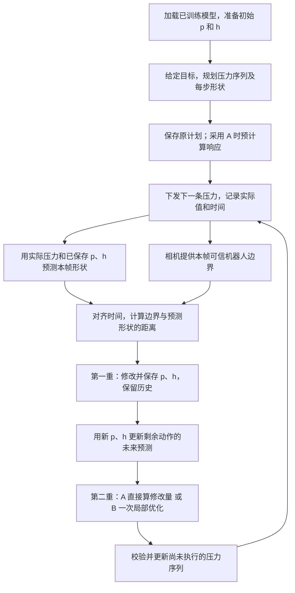

# 遮挡下 hereditary 两重校正控制设计

阅读顺序：第 2 节说明实机流程和必要内存，第 3 节说明初始化、图像匹配和误差，第 4–5 节说明两重校正，第 6 节处理延迟，第 8.4 节给出下一轮已有数据实验。公式统一使用 `$...$` 与独立行的 `$$...$$`，编号写在公式外，避免依赖 LaTeX 编号扩展；预览器仍需支持数学渲染。

## 1. 当前保留的方案

**任务：软臂连续运动期间存在部分视觉遮挡，利用可见臂段持续更新全身状态估计，并修正剩余压力序列以完成当前任务。** 先训练 hereditary 前向模型，任务开始前优化一次完整动作序列；运行时进行两重校正：

| 层次 | 校正对象 | 作用 | 是否直接改变动作 |
|---|---|---|---|
| 第一重：在线状态校正 | hereditary 内部历史状态 | 用可见观测约束当前估计，保留历史，使当前及后续预测更符合实际 | 否，须交给第二重 |
| 第二重：剩余序列校正 | 尚未执行的压力序列 | 从校正状态出发，修订剩余动作，使当前任务继续接近目标/参考轨迹 | 是，在合法边界替换后缀 |

**每帧的顺序必须是：预测当前形状 → 与图像中可信可见边界比较 → 修改预测器保存的历史状态 → 用修改后的历史预测后续运动 → 修改剩余压力 → 执行。** 第一重修改现有模型的 `p,h`，不是只修显示骨架；第二重必须读取这次接受的 `p,h`。固定网络参数是当前基础算法的一项选择，不是模型更新必须遵守的限制：该选择与逐帧训练权重不同，不能把它称为已实现在线参数学习。第 4 节用当前代码公式说明两者的区别、实际修改位置及作用范围。

第二重保留两个并列候选：

- **方案 A：预计算动态响应映射，在线直接计算整个剩余序列的修正量。** 保留清晰的状态—形状—压力响应关系，作为在线计算开销较低的候选。
- **方案 B：以上一次剩余序列为起点，更新局部预测与灵敏度，做一次有限规模优化。** 适应当前状态与约束变化，不重新进行多起点、长时间非线性规划。

两者都采用“修订剩余序列 → 执行前缀 → 新观测到来再修订”。**不是只允许修改下一步，也不是根据一帧观测修改后就执行到底。** 通过相同任务、观测、第一重校正和执行接口比较精度与端到端时延，目前不预设哪种更好或必须混合使用。

本文件合并原总体框架及 `2026-09-08_occlusion_fast_feedback_algorithm.md`，作为此方向唯一 design。保留必要推导、文献依据和讨论结论，去掉重复及未确定的复杂扩展。状态为待审阅草案；用户确认后再实施。当前尚未完成观测校正、后缀替换和实物闭环，不含新增性能结果。[v6 文章](../paper/manuscript_partial_observation_v6_zh.md)仍为旧研究设置，不能作为本方案实施依据。

**这套待实现的方案属于基于状态估计的闭环控制。** 判据是：真实观测是否改变后续实际执行的压力。观测更新 p、h，更新后的预测又改变压力序列，反馈链就闭合了；不要求网络权重变化，也不要求看到全部机器人。如果只校正显示出来的形状、始终执行原压力序列，则只有在线估计，没有任务动作反馈。遮挡期间仍有可靠可见片段时是部分观测闭环；全部测量无效期间依赖模型继续执行，是暂时失去视觉反馈。现有软件尚未实现这条完整反馈链，不能将设计能力写成当前实测能力。

## 2. 实机上从开始到每一帧做什么

### 2.1 先说明保存的内容有什么用

“保存”主要指保留在内存中，不是每帧写文件。用户说的“用新的 p、h 覆盖当前 p、h”就是正常的运行方式；区别只在于相机有延迟、规划会尝试未执行动作，因此还需要少量有明确用途的工作数据：

| 保存内容 | 简单含义 | 用途 |
|---|---|---|
| 最终目标、必要的中间形状或限制 | 用户要求软臂最后到哪里，过程中哪些要求必须满足 | 判断改过的动作是否仍在完成同一个任务 |
| 第一次规划的压力序列；A 使用的原轨迹/响应缓存 | 原来打算怎么走；在什么状态和动作附近计算线性响应 | 初始执行及 A 的计算基准；B 不必永久保留每个原预测状态 |
| 当前 `p,h`、最后实际指令、上次修改后尚未执行的压力 | 对真实机器人当前情况的估计，以及现在准备执行什么 | 每帧预测校正和动作修改的直接输入 |
| 当前状态的时间、版本及误差尺度 P | 当前 p、h 对应哪个时刻，估计有多可靠 | 时间对齐、避免覆盖新结果及第 4 节状态校正 |
| 最近一小段实际指令和带时间的状态快照 | 相机看到的是稍早的机器人 | 回到图像时刻校正，再用真实指令推回当前时刻；只保留覆盖允许延迟的环形缓冲 |

网络权重 θ 单独加载一次；控制器持有 `current_z = [p,h]`。现有 `forward` 通过 `prev_z` 输入、`latent_z` 输出传递历史，不自动在模型实例内记住上一帧。未来可用一个控制器对象包装它，接受校正后覆盖 `current_z` 即可，不必修改模型文件或 checkpoint。当前形状可以即时读出；为了画图或图像搜索可短暂缓存，不能把旧缓存当作最新状态。

若完全同步、没有延迟且串行运算，单份当前状态就足够递推；实际部署的短缓冲是处理时间错位所需，不是 hereditary 要求保存无限历史。规划和异步计算持有状态副本，接受结果时替换当前状态；不能对共享张量原地写入而改变正在计算的副本。用于论文分析的磁盘日志另行异步记录，详见第 7 节。

**只有终点目标时，不要求严格经过原计划的每个中间形状。** 目标函数可只强调终点和必要约束；若任务确实要求全身沿某条轨迹运动，才给中间形状设置跟踪权重。原计划还有“计算局部响应的位置”这个用途，即使不严格跟踪它，也可以用于方案 A 的预计算。原计划的预测不是实际测量，更不是不能修改的后续动作。

### 2.2 运动开始前

1. 加载已训练的模型，包含压力到驱动的变换、迟滞/松弛读出权重及几何映射。
2. 从可复现的准备过程建立初值，用实际压力历史持续推进 `p,h`，观察初始形状并作必要校正。单张初始形状不等于全部历史，见第 3.1 节。
3. 给定目标，从当前 `p,h` 的副本出发优化压力序列，导出所需形状及状态轨迹。不让试探动作改变真实估计；不要求永久保存所有候选轨迹。
4. 若采用 A，在运动前计算局部响应映射；采用 B 则保留该序列作为以后每帧小幅修改的起点。
5. 初始规划耗时期间，机器人即使保持压力也可能继续松弛，状态跟踪不能暂停。发第一条动作前，按实际保持历史和最新有效图像更新初态，校验计划；小偏差使用所选 A/B 修订，大偏差在运动前重新规划。不能把几秒前的状态直接当作开始执行的状态。

### 2.3 开始运动：先执行第一条压力

下发第一条压力，记录实际下发值和时间；若软件限速改变了它，就用改变后的实际指令推进模型。模型用同一个实际指令和保存的 `p,h` 预测接下来这一帧的状态。相机随后提供相同时刻的局部图像证据，进入以下循环。不能从保存计划直接跳到第二重、而没有预测—实测比较和第一重。

### 2.4 之后每一帧：严格按顺序

| 步骤 | 假设已经运动到第 k 帧 | 产生的内容 |
|---|---|---|
| 1. 预测这一帧 | 从上次校正的 `p,h` 出发，用期间实际下发的压力推进一次或数次 | 本帧校正前的 `p,h` 和全身预测骨架 |
| 2. 看这一帧哪里预测错了 | 将图像中可信机器人边界与同一时刻预测的管状形状比较；隐藏区域不参与测量误差 | 可见形状误差 |
| 3. 第一重：修正预测器的历史 | 固定本帧已发生的压力，以旧 `p,h` 为起点，只调整能解释观测的部分，限制过大更新 | 新的 `p,h`，不清空整段历史 |
| 4. 更新对剩余动作的预测 | 从新的 `p,h` 出发，检查继续执行上次剩余压力会到哪里；A 用局部响应近似，B 做一次前向推演 | 第一重之后的未来预测，而不是最初保存的旧预测 |
| 5. 第二重：修正动作 | 根据步骤 4 与最终目标/所需中间形状的差异，算出整段剩余压力的修改量 | 新剩余压力序列 |
| 6. 接入执行 | 在尚未发送的动作边界接受新序列；已执行动作不改写 | 下一条或下一次观测前的一小段实际压力 |
| 7. 留给下一帧 | 保留新 `p,h`，用新实际指令推进；保留尚未执行的新压力序列 | 下一帧从本帧结果继续，不重新从零开始 |

步骤 4 是两重校正之间不可缺少的连接。若步骤 5 还用旧 `p,h` 或最初保存的未更新预测计算压力，则第一重没有参与当前控制，接口不符合本设计。第一重也不是在任务结束后才产生作用。



| 对象 | 含义 | 更新规则 |
|---|---|---|
| 目标/所需形状 $S^{\mathrm{ref}}$；原计划 $\bar X,\bar U$ | 前者说明任务要求，后者记录第一次规划与线性化位置 | 不能把预测值直接写成新目标；原计划不限制后续动作必须原样执行 |
| 在线状态估计 $\hat z$ | 对机器人实际当前历史状态的估计 | 按实际已下发动作推进，接受真实可见观测校正 |
| 当前工作序列 $U^{\mathrm{old}}$ | 上一次已接受、尚未执行的后缀 | 接受 $U^{\mathrm{new}}$ 后替换；执行部分移除，余下作为下一次修正起点 |

规划候选只使用状态副本。试探动作不能推进真实在线估计，未来候选也不能改写已经发生的指令。

保留两个误差：**观测减当前预测**用于第一重；**预测未来运动相对任务参考的偏差**用于第二重。原来只保存一次预测时，计划形状与模型预测是同一条；加入在线更新后才会出现“当前预测已符合观测，但仍偏离原计划”。这是两套对象的区别，不是声称原来一条预测同时代表两个位置。

## 3. 模型、初始化与时间约定

固定指令周期 $\Delta t$，动作变化及任务时长决定运动速度，不与控制频率混用。$u_k\in\mathbb R^4$ 在 $[t_k,t_{k+1})$ 下发，经四到六通道映射形成压力指令。以实际 issued command 递推；`applied6` 是软件限速/映射后的指令，不是实测腔压。

令 $z_k$ 已经消费到 $u_{k-1}$，$s_k$ 为当前骨架，区分状态推进与非推进读出：

式（1）：

$$
z_{k+1}=f_\theta(z_k,u_k),\qquad s_k=g_\theta(z_k,u_{k-1}).
$$

逐通道 hereditary 递推为

式（2）：

$$
p_{k+1}=\operatorname{clip}(p_k,e_k-r,e_k+r),\quad
h_{k+1}=\alpha h_k+(1-\alpha)e_k,\quad
e_k=d_\theta(u_k),\quad\alpha=e^{-\Delta t/\tau}.
$$

读出以 q=e−p、h−e 和参考映射生成转角、长度及中心线。典型四输入、每通道两 play/六 Maxwell 配置有 32 个历史状态、15 个平面节点；维度、步长与归一化须读取 checkpoint。不能将当前平面模型写成任意三维形状估计，也不默认它包含一般接触力或惯性振荡状态。

初始化使用已记录准备动作历史，再用初始可用视觉校正；单张骨架不自动确定全部历史。任务衔接可保留状态，长时间保持也不保证消除全部 play 记忆。训练数据应包含连续动作、反向、保持和较快变化；按独立物理试次划分训练/验证/测试，不以稳态数据或开发集误差代替动态控制验证。

在节点身份已知的简化实验中，部分观测为

式（3）：

$$
y_k=M_ks_k+v_k.
$$

$M_k$ 只选择真实可见坐标。遮挡后不能将剩余可见曲线重新等分为“全身 15 点”；必须保留节点身份或完成可靠匹配。模型补出的隐藏节点不算测量。先用已知节点 mask 验证算法，再接真实遮挡前端。

图像采集、处理完成和下一条可修改动作有不同时间。应在采集时刻校正历史，再重放之后实际下发的动作，传播到后缀生效边界。状态测量公式中的 k 指观测对应的模型时刻，动作修正公式中的 k 指将该状态传播到的可修改边界；若两者不同时，不可直接沿用同一个状态值。同一动作只推进一次，同一图像只作为新测量注入一次；旧训练数据的实际时间配对必须核查，不能只改帧号视为解决了延迟。

### 3.1 初始化：从连接开始递推，但连接不是历史的起点

推荐的首版部署次序是：**连接设备 → 执行已有硬件允许的可复现准备动作 → 保持并采集初始可见形状 → 接受初态 → 指定目标并规划 → 连续运动。** 准备动作的幅度、保持时间沿用设备已验证范围，之后通过已有序列的初始化对照确定，不在设计中凭空规定压力。

- 连接之前的驱动历史未知，不能因为开始记录就认为真实记忆为零。连接后记录能避免丢掉新历史，但仍需初始假设及其误差范围。
- 持续保持驱动 e 时，Maxwell 状态满足 $h_n=e+\alpha^n(h_0-e)$，会逐渐接近 e；play 则在第一次截断后可能保持区间内的原值。因此保持不能一般性地推出 $p=h=e$。代码中的 equilibrium 初值是初始化假设，不能当成保持操作必然得到的物理事实。
- 以 checkpoint 配套初始化方式建立先验，再重放准备动作；用初始可见测量有限校正。若初始图像不完整，保留更大的估计误差，不凭一张图声称全部记忆已确定。
- 一个任务结束后开始下个任务，通常继续保留 p、h；设备重启、未记录的手动动作、模型版本/归一化改变时，该状态不能直接沿用。多任务之间也要记录实际保持时间。
- 保持压力时仍按模型的时间步推进 Maxwell；只在压力数值改变时更新状态会漏掉松弛。无需为了递推而重复发送相同命令，但需知道该时段实际保持了哪条指令。

初始化是否足够应由“之后同一段真实动作的预测误差”判断，不只看初始图像拟合。状态校正允许修复历史估计，但无法保证补偿错误的坐标变换、驱动标度或模型外扰动。

### 3.2 图像中真正能得到什么

**看得到的片段是测量，看不到的部分只能估计。** 不尝试从完全不透明遮挡后直接提取机器人像素，也不要求每张图都输出完整 15 点骨架。感知前端输出的是若干有效局部测量及其时间、位置、方向和可信程度，模型负责根据这些约束生成完整骨架。

当前实现需要调整的地方已核对如下：

| 现有代码 | 遮挡情况下的问题 | 首版计划 |
|---|---|---|
| `real_validation/perception/segmentation.py` 的 `_clean` | 只保留最大连通区域，会丢弃被遮挡物隔开的其他有效臂段 | 从候选 mask 保留多个有图像证据的片段，按外观、宽度和预测附近位置筛选 |
| `segment_white_on_blue_stages` | 最终选择一个主要区域；闭运算、填洞可能跨越遮挡产生假连接 | 使用最终选块之前的候选；仅清理片段内部噪声，不将跨遮挡连接作为实测 |
| `real_validation/perception/skeleton.py` 的路径提取和重采样 | 最长路径/基座可达路径及全长等分隐含完整连通骨架 | 真实图像主方案直接提取可信侧边，绕过骨架化；局部骨架仅作对照 |
| 现有 RGB 采集 | 当前路径只采集彩色图像，没有可直接用于遮挡判断的深度测量 | 首版按单相机平面 RGB 方案设计，不默认拥有 RGB-D 可见性判断 |

分割快不等于局部测量可靠。尤其遮挡物与机器人颜色相同、管线反光、片段过短时，应输出“不确定/无有效测量”，而不是硬生成骨架。可见末端片段的截断点也不能自动叫机器人尖端。

### 3.3 怎样从图像获得校正信息：方法选择

上一版把“可见曲线”作为输入，容易被理解为仍需先做骨架化。遮挡后局部 mask 的中轴会受截断、缺边和分支影响，方向和位置未必代表真实中心线。**本轮将真实图像首版改为直接利用可见边界约束预测形状，不要求先恢复观测骨架。** 预测骨架仍是模型输出，也是动作规划所用形状；改变的是图像到状态校正的测量接口。

用户提出的“固定半径扩展骨架，再与图像比较”提供了适用的几何基础，但不必真的逐帧绘制整张图、再做所有像素之差。根据同一形状模型，可以选择稀疏轮廓误差或稠密区域误差：

| 方法 | 从图像取什么，怎样比较 | 对当前任务的判断 |
|---|---|---|
| 局部骨架/中心线匹配 | 对可见 mask 细化或由双侧边缘求中点，再与预测中心线比较 | 两侧边缘都清楚时可用；遮挡截断会改变中轴，单侧可见时更不可靠。保留为对照，不作为首版必需输入 |
| 可见边界到预测管状形状的距离 | 在预测轮廓附近寻找有图像证据的机器人真实侧边，将这些边界像素代入预测形状的距离场 | **建议首版优先实现**。无需观测骨架或全图可见性，已知半径时单侧边缘也可提供局部约束；主要风险是边缘身份判断和半径失配 |
| 预测软 mask 与图像前景概率匹配 | 将骨架扩成连续可导的占据概率，与可靠可见区域的前景/背景概率比较 | 作为第二个感知候选，边缘模糊但区域分割可靠时可能更好；须有可信的区域权重，否则遮挡会被当成形状错误，计算量也需实测 |
| 可见关键点/光流跟踪 | 跟踪能重复识别的纹理点或标记，用其图像位置/位移约束状态 | 有稳定纹理或已有标记时可能更直接，且不依赖固定臂宽；当前均匀臂身未验证足够纹理，长遮挡后的对应也会丢失。暂不为此新增标记或学习器 |
| 直接 RGB/纹理误差 | 用模板或外观模型预测颜色，再与相机图像比较 | 当前模型只有几何输出，没有已验证的光照/纹理预测器；反光和阴影易成为错误状态更新。可用颜色判别边缘身份，首版不以原始 RGB 全图误差作主目标 |

前两类几何误差以及软 mask 匹配均属已有视觉跟踪/配准思路，不能仅因接入 hereditary 就宣称新控制原理。此处的选择依据是现有模型、部分可见信息和待测实时预算。两种图像候选均使用同一个 p、h 校正器和相同 A/B 动作算法，先隔离比较感知方式，不同时改动整个控制框架。

### 3.4 预测形状如何与真实图像比较，并传回 p、h

#### 3.4.1 骨架加半径：建立图像测量模型

令 $z=[p,h]$，由非推进读出 $g_\theta(z,u_{k-1})$ 得到预测骨架。经过 checkpoint 反归一化、曲线插值、模型到相机的变换和裁剪/缩放，得到像素平面中心线 $C(a,z)$，其中 a 为沿曲线的位置参数。

在固定半径且像素变换为等比例的假设下，设像素半径为 $r_{\mathrm{px}}$，预测区域可写成

$$
\phi(x,z)=\min_a\|x-C(a,z)\|_2-r_{\mathrm{px}},
\qquad
\widehat\Omega(z)=\{x:\phi(x,z)\leq0\}.
$$

这就是“离骨架不超过一个半径”的区域。在平滑、不自交的臂身侧面，边界等价于 $B^\pm(a,z)=C(a,z)\pm r_{\mathrm{px}}n(a,z)$；端部还需封口，不能只画两条平行偏移曲线。用到中心线的距离可统一描述折线各段和端部的管状区域。该函数是形状的隐式距离表示，不要求它在所有自交或高曲率位置都等于到外轮廓的严格有符号距离。

现有 `scripts/real/skeleton_to_shape.py` 已有相同的固定半径几何思想，但通过 OpenCV 整数坐标、粗折线和圆生成二值 mask，适合可视化/离线比较，不能直接作为 PyTorch 可导测量函数。未来校正器只需以浮点张量计算候选像素到预测折线/曲线的距离，不必建立全图渲染网络。首版用与当前解码一致的折线表示，先测其离散误差；不随意改成与训练/规划不同的平滑曲线。

半径由独立开发数据或任务前的清晰图像确定并在任务中固定；不从当前被遮挡 mask 的距离变换重新估计，也不使用测试未来帧拟合。已有脚本自动拟合半径和 variable 模式使用输入参考 mask，不能原样当作无真值部署算法。若图像做非等比例缩放或投影不满足平面等比例条件，应先在物理坐标扩成管再变换外轮廓，不能沿用一个任意像素半径。

#### 3.4.2 从图片找边界：不经过骨架化

一次观测按以下步骤产生少量可用边界像素 $q_j$：

1. 用短缓冲得到图像采集时刻的预测状态，生成该时刻的中心线和预测侧边。始终使用同一时间与同一 crop 坐标，不使用处理完成时的形状代替。
2. 沿预测侧边布置搜索点，以局部预测法线为主要搜索方向；允许有限角度变化和位置偏差。搜索带宽来自开发误差、臂宽及时间不确定性，不要求真实边缘方向与旧预测严格相同。大偏差超出局部范围时需重新定位。
3. 在搜索带中用灰度/颜色梯度或轻量前景概率的过渡找边界候选。检验边缘两侧的机器人/非机器人外观、梯度方向、片段内连续性和匹配唯一性；有双侧边缘时，再检验宽度及左右顺序。分割可用于提供局部前景概率，但无需产生完整 mask 或连通中心线。
4. 接受高置信度的单侧或双侧机器人真实边缘，保留边界像素、所属预测局部臂段、置信度和图像时间。**有固定半径后，单侧边缘可以产生约束，不必先求出双侧中点。** 但单侧约束更容易受宽度误差影响，应反映在测量权重和对照中。
5. 排除遮挡造成的截断边缘、图像裁剪边缘、连接件/管线和身份不明的边缘。通常可用方向、局部外观和双侧一致性辅助，但单目 RGB 并不保证区分所有遮挡物；相似外观或方向碰巧一致时允许拒绝，不能把距离预测近当作真值。
6. 固定本次接受的图像证据、匹配臂段和权重，计算一次状态校正。没有有效边界就跳过测量更新；连续失败时用扩大搜索或图像独立检测重新定位，不能用预测轮廓自身填补测量。

特别注意，分割得到的“可见区域边界”不全是机器人原本的外轮廓。例如遮挡物横跨软臂形成的一条截断线，不能拉动预测骨架去贴这条线。严重自重叠处或管状假设不适用的端帽/底座首版可排除；需单独声明这些区域没有提供该类测量。

#### 3.4.3 首版建议：边界像素到预测形状的距离

若 $q_j$ 确实是机器人的可见侧边，正确预测应使 $\phi(q_j,z)$ 接近零。设本帧先验为 $\hat z^-$，定义

$$
f_j(z)=\phi(q_j,z),\qquad
r_j=-f_j(\hat z^-),\qquad
J_j=\left.\frac{\partial f_j(z)}{\partial z}\right|_{\hat z^-}.
$$

首版解一次带先验和有限步长的加权问题：

$$
\delta z^*=\arg\min_{\delta z}
\sum_{j\in\mathcal V} w_j\,
\rho\!\left(\frac{f_j(\hat z^-)+J_j\delta z}{\sigma_j}\right)
+\|\delta z\|_{(P^-)^{-1}}^2,
\qquad \hat z^+=\hat z^-+\delta z^*.
$$

这里 $\mathcal V$ 为接受的真实边界，$\sigma_j$ 是像素误差尺度，$\rho$ 可用 Huber 损失。固定稳健权重后等价于第 4 节的 $J\delta z-r$ 形式；当前压力和半径固定，未知量仍只有 p、h 的修正。相邻边界像素高度相关，应限制采样密度/片段总权重；不能把整条边的每个像素都当成独立高精度测量。

**误差传回历史的路径是：p、h → 几何骨架 → 图像中的管状形状 → 真实边界处的距离。** 图像检测步骤不必可导；本次找到的 $q_j$ 作为常量。只对模型产生的形状求导：

$$
J_j=
\frac{\partial\phi(q_j,z)}{\partial C}
\frac{\partial C}{\partial s}
\frac{\partial g_\theta(z,u_{k-1})}{\partial z}.
$$

其中 s 表示网络骨架输出，第二项包含反归一化、插值及投影。到折线段的距离在最近段唯一、非退化的位置可局部求导；最近段切换时是分段光滑的。用局部臂段匹配避免跳到另一条靠近的臂段，在一次求解中固定离散关联，并限制修正幅度。候选更新后在相同图像证据上复算非线性距离与状态边界；不满足接受条件则缩小更新或拒绝，而非无限次重匹配直到残差看起来很小。

例如，预测某横截面的右侧边界位于 x=110 px，图像中可信右侧边缘位于 x=113 px，固定半径为 10 px。在局部竖直臂段的简化情形，边界相对预测外移了 3 px，测量约束会推动相应预测轮廓向右，而无需先提取观测中心线。**它不意味着直接把某个骨架点平移 3 px**：实际 p、h 更新由全部边界约束、模型导数和历史先验共同决定，第二重再依据新状态改变压力。

#### 3.4.4 另一个值得比较的方案：可靠区域上的软 mask 误差

若局部前景概率比单条边缘定位稳定，可以由相同距离表示得到软占据图：

$$
\widehat m(x,z)=\operatorname{sigmoid}\!\left(-\frac{\phi(x,z)}{\epsilon}\right),
\qquad
L_{\mathrm{image}}(z)=
\sum_{x\in\mathcal R}v_x\,
\ell\bigl(\widehat m(x,z),m_I(x)\bigr).
$$

$m_I(x)$ 是图像给出的机器人前景概率，$\epsilon$ 为边界软化的像素尺度，$\mathcal R$ 是局部 ROI；$v_x$ 只允许可靠、未被遮挡的前景/背景证据参与。可用加权平方误差构造与第 4 节相同的一次线性化，或单独评估其他损失。只采样边界附近及少量可靠内外区域，不必对整张 RGB 逐像素优化；先比较完整耗时再判断哪种更快。

**不建议直接用整张二值 mask 的 IoU 或像素差校正 p、h。** 被遮挡的真实机器人会在观测前景中消失，如果把它当作已确认背景，优化可能让软臂缩短或移开来“解释”遮挡。未知区域必须无权重；没有可靠遮挡判断时，宁可只使用已确认侧边，不能为了获得稠密误差而假定知道可见性。权重在一次更新中固定，不能仅因与模型不一致就把所有难点删掉来降低损失。

该方案可能更能利用模糊边缘附近的区域证据，但引入了区域可见性和概率校准的要求。因此先做稀疏边界距离，再用同预算软 mask 对照检验收益，不预设一定更优。二者都不需要从遮挡图像恢复完整观测骨架。

#### 3.4.5 半径假设、不可辨识方向与保留的骨架对照

固定半径是应验证的近似，不是由“软体机器人”自然保证。压力可能改变臂宽，透视、非平面运动、局部挤压及端部形状也可能改变轮廓。只有单侧边缘时，“中心线平移”和“半径改变”可产生相似误差；若同时任意更新半径和 p、h，单帧部分图像很难区分它们。

因此首版任务内固定半径，用独立清晰图像评估臂宽随压力/位置的变化，并把测得的宽度偏差计入测量误差或剔除不适用区域。双侧都可见时，两侧同向移动更支持中心线偏移，两侧向外张开更提示宽度变化；这些只作诊断，不自动把全部外形失配写进历史。若宽度变化足以主导误差，再比较任务前固定的分段半径或单独形状模型，暂不增加每帧自由半径拟合。

R1 中仍保留已知节点身份的骨架误差，用于隔离验证状态算法；实际图像中的双侧边缘中点/局部骨架只作感知对照。新的主接口是 `image_evidence → residual(z), Jacobian(z)`，而非强制 `image → 15 个观测节点`。图像边界与节点误差的单位、协方差和样本相关性分别处理，不未经校准混在一个损失里。

可见轮廓也不能保证唯一确定所有历史。几何导数弱、部分臂段长期不可见或多个状态产生相同可见轮廓时，保留历史先验限制更新；隐藏形状及未来响应是否改善仍由独立评价决定。不能把“轮廓重合更好”直接等同于“真实历史和控制都更准”。

### 3.5 先评估轻量感知的理由及现有计时证据

已有归档 `workspace/runs/analysis/online_segmentation_benchmark/legacy-import/seq_20260819_182519/summary.json` 记录了 3073 帧的离线基准；本次只读取归档，没有重跑：

| 归档方法/指标 | P50 | P95 | P99 |
|---|---:|---:|---:|
| 传统分割＋完整骨架提取耗时 | 17.59 ms | 19.73 ms | 25.38 ms |
| 因果 SAM2 估计处理总耗时 | 156.40 ms | 159.56 ms | 161.19 ms |

传统方法的平均节点误差为 1.02 mm，但 P99 为 14.99 mm；SAM2 对应为 0.58 mm 和 2.01 mm。参考是离线双向 SAM2 的伪真值，不是独立全身测量；`cuda:2` 仅是归档设备标识，不能推出部署机器型号或部署时延。SAM2 总耗时包含摊销初始化/提示及前向、骨架处理，不包含曝光和控制；官方目录视频接口仍需增量帧适配。传统方法最大单帧处理约 93 ms，也不能仅凭 P95 宣称必定赶上 100 ms 指令周期。

这些数据说明轻量方法值得先试，也说明必须处理少数大错误；它们**没有证明遮挡下的精度或闭环实时性**。预测引导新算法尚无计时结果。现有 `scripts/real/benchmark_online_segmentation.py` 可借用计时、分项统计方式，但完整路径骨架指标需按片段测量重新设计。

## 4. 第一重：保留历史的在线状态校正

### 4.1 对照当前网络，究竟修改哪里

当前 `HereditaryGeometryModel.forward` 会读取 `prev_z`，解包得到 p、h，然后用新压力推进并生成骨架；输出 `latent_z` 保存推进后的 p、h。`prev_skeleton` 和 `prev_prev_skeleton` 被显式忽略。因此，仅将观测骨架传回这两个参数不会改变现有模型的后续预测。

以下将多通道和多算子展平，驱动 e 按通道广播。当前历史对读出的作用可写成：

$$
q_k=e_{k-1}-p_k,\quad d_k=h_k-e_{k-1},\quad
m_k=W_P\operatorname{vec}(q_k)+W_M\operatorname{vec}(d_k)
+\varepsilon_\theta(q_k,d_k).
$$

这里 m 是对弯曲/长度坐标的历史贡献，不是最终骨架；$W_P,W_M$ 合并代码中的增益、方向和固定尺度。$\varepsilon$ 对应可选 memory residual，配置为 none 时为零。实际几何读出继续为

$$
\beta_k=\beta_{\mathrm{ref}}(u_{k-1})+B m_k^{\mathrm{bend}},\quad
\ell_k=\ell_{\mathrm{ref}}(u_{k-1})+m_k^{\mathrm{length}},\quad
s_k=\operatorname{Geom}(\beta_k,\ell_k).
$$

这里 $\beta_k$ 表示弯曲坐标、$\ell_k$ 表示代码中的对数长度坐标。B 是当前模型的弯曲基；物理骨架随后按 checkpoint 归一化。对应代码依次为 `_structured_memory`、`_memory_residual`、`_decode_generalized`。

第一重具体执行：

$$
p_k^+=p_k^-+\Delta p_k,\qquad
h_k^+=h_k^-+\Delta h_k.
$$

| 内容 | 本帧是否修改 | 在代码中的对应 |
|---|---|---|
| p、h | 是，以历史估计为起点加有限修正 | `prev_z` / `latent_z` 中的数值 |
| 已下发压力和当前驱动 e | 否，已发生输入不能因观测误差改写 | 动作日志及由该动作算出的 drive |
| 压力变换权重、历史读出增益/方向、可选残差网络权重 | 当前基础版不改 | drive、play weights、maxwell gains、mode directions 等 |
| 阈值、松弛时间、弯曲基、长度尺度 | 当前基础版不改 | 此实现中的配置/缓冲，不能统称为本帧训练出的参数 |

用修正后的 p、h 重新算 q、d 和 m，当前骨架就会变化。尤其在 residual 关闭或先忽略其变化时：

$$
\Delta m_k=-W_P\operatorname{vec}(\Delta p_k)
+W_M\operatorname{vec}(\Delta h_k).
$$

这解释了“权重没变，为何预测会变”：同一套已学关系，使用了根据实测修正过的历史。校正的是模型当前的记忆数值，不是把实测点贴在最终输出上。

### 4.2 怎样根据可见形状算出修改量

按实际动作推进先验 $\hat z_k^-$，读出 $\hat s_k^-=g_\theta(\hat z_k^-,u_{k-1}^{\mathrm{issued}})$。先对节点身份已知的情况计算可见残差与局部导数；真实图像则换用第 3.4 节边界到预测形状的距离残差和导数，后续求解相同：

式（4）：

$$
r_k=y_k-M_k\hat s_k^-,\qquad
J_k^z=M_k\left.\frac{\partial g_\theta}{\partial z}\right|_{\hat z_k^-,u_{k-1}}.
$$

首版保留一次带先验的线性化校正：

式（5）：

$$
\delta z_k^*=\arg\min_{\delta z}
\|J_k^z\delta z-r_k\|_{R_k^{-1}}^2+
\|\delta z\|_{(P_k^-)^{-1}}^2,
\qquad\hat z_k^+=\hat z_k^-+\delta z_k^*.
$$

无约束解相当于一次 EKF measurement update：

式（6）：

$$
L_k=P_k^-(J_k^z)^T\bigl(J_k^zP_k^-(J_k^z)^T+R_k\bigr)^{-1},
\qquad\delta z_k=L_kr_k.
$$

$P^-$ 表示历史先验误差尺度，可采用 EKF 传播；$R$ 对应测量噪声。未经校准的设计权重不直接称为真实不确定度。使用分解求解而非显式求逆。部分节点的单帧测量通常不能唯一恢复全部状态，历史先验用于限制欠观测方向的任意变化。

若采用 EKF 式误差传播，还需按状态转移导数 $A_k^z$ 维护 $P_{k+1}^-=A_k^zP_k^+(A_k^z)^T+Q_k^z$，其中 $Q_k^z$ 是待校准的过程误差尺度。无约束线性更新可用 Joseph 形式 $P_k^+=(I-L_kJ_k^z)P_k^-(I-L_kJ_k^z)^T+L_kR_kL_k^T$。P 与 p、h 一样仅保留当前值及延迟缓冲；并非保存所有历史。若首个原型用固定对角 P 作正则，则应明确叫固定权重状态校正，不宣称已实现完整 EKF。稳健重加权、投影和 play 分支切换下的误差传播属于局部近似，需做校准及消融。

校正须保留必要状态边界和步长限制。当前驱动 e 对应 play 界限 $e-r\le p\le e+r$；Maxwell 界限依 checkpoint 驱动范围与初始化确定，不无条件裁到 [0,1]。先求解再投影可作简化，但不等于受约束问题的精确解；这些必要边界也不证明全部状态对应唯一真实历史。

校正只调用非推进读出，不能用又消费动作的 `forward` 评估当前形状。固定网络参数 $\theta$，不在线训练。校正状态持续用于当前任务后续预测；第二重的候选计算不能覆盖或污染它。

从实现角度说，式(5)把 `delta_p, delta_h` 当作未知量，计算“它们变化一点，图像中可见边界处的预测形状误差会改变多少”，再解一个带历史先验的小问题。PyTorch 可以对状态副本求 Jacobian，而不更新模型权重；冻结参数不等于禁止对输入状态求导，也不能将整个观测函数放入 no_grad 后仍期望自动得到该导数。求解结束，把接受的 p、h 打包为新的 `latent_z`，交给后续预测及动作修正。不是每帧重新调用 burn-in 覆盖它。

### 4.3 本帧校正怎样影响下一帧及整段动作

即使未来压力暂时完全不改，下一步也会从修正状态出发：

$$
p_{k+1}^-=\operatorname{clip}(p_k^+,e_k-r,e_k+r),\qquad
h_{k+1}^-=\alpha h_k^++(1-\alpha)e_k.
$$

对相同未来输入，Maxwell 校正带来的下一步差异是 $\Delta h_{k+1}=\alpha\Delta h_k$，再下一步为 $\alpha^2\Delta h_k$。例如仅作无量纲算式示意，$\alpha=0.8,h_k^-=0.40$，观测校正后 $h_k^+=0.45$，下一驱动为 0.70：原预测下一 h 为 0.46，新预测为 0.50；随后差异继续传播。实际形状的变化还要通过上述读出计算，不能将 0.04 直接解释成毫米或控制收益。

play 修正也会传播，但在后续输入将两种状态截断到同一边界时，差异可以消失。**历史被保留并按模型继续演化，不等于本帧校正永久不衰减，也不保证任何误差都能用 p、h 解释。**

第二重 B 的第一行必须等价于 `rollout(corrected_z, remaining_actions)`；A 则必须将 `corrected_z` 代入式(8)的状态差，再计算未来预测变化和压力修正。就同一时刻、同一旧序列、忽略投影且固定线性映射而言，第一重给 A 增加的动作变化为

$$
\Delta U_k^{\mathrm{after\ state\ update}}-
\Delta U_k^{\mathrm{before\ state\ update}}
=-Q_k\mathcal O_k^z\delta z_k.
$$

$\mathcal O_k^z$ 取对应 p、h 的列。该关系可以直接在日志与数值检查中核对。若更新恰落在不影响该任务的方向，动作变化也可能为零；不能强制每个观测误差都产生任意气压变化。

### 4.4 状态校正与真正的在线参数学习

当前“固定参数”选择的理由是：先检验模型当前记忆估计错误是否可被观测修正，同时保留快速动作映射的模型基础。单帧部分形状通常不能区分“当前状态估计有误”和“模型规律本身不对”；同时任意调整状态与全部权重会使归因和实时实现都更困难。

但这是可检验的基础方案，不是说学习权重无用。若“在线学习”明确指每帧改变压力—运动关系的权重，并让经验在重新初始化状态后仍然保留，则上一版算法**没有**完成这一要求：必须增加参数 $\theta$ 的更新，而不能把 p、h 的校正改称训练网络。参数适应需使用过去有效观测/输入的多步误差、限制遗忘，并在第二重使用同一更新后的模型版本；A 的缓存响应也需重算或验证，不能沿用旧权重的映射却声称基于新模型。

本次保留 p、h 校正的完整基础流程，并把上述差异明确列出；未擅自增加逐帧训练全网络的实施路线。若未来证据显示持久的权重失配不能由状态更新处理，再具体设计参数适应并独立比较。判断是否有用要看相同后续真实动作下的预测以及真实控制，不只看当前可见误差下降。

## 5. 第二重：修订当前剩余序列

任务开始前规划得到 $\bar U,\bar X,\bar S$。$S^{\mathrm{ref}}$ 只表示希望达到的形状：只有终点要求时，可将中间形状的跟踪权重设为零，保留终点及输入/任务约束；需要按原路线运动时才跟踪中间形状。终点始终对应用户真实目标，原规划未消除的目标残差不能忽略。第 4 节输出的更新后 p、h 是以下 A/B 的共同输入，禁止跳过第一重而沿用旧状态。

在边界 k，以校正状态和上一次剩余序列预测未来 H 步，定义

式（7）：

$$
b_k=\mathcal F_k(\hat x_k^+,U_k^{\mathrm{old}})-S_k^{\mathrm{ref}},
\qquad U_k^{\mathrm{new}}=U_k^{\mathrm{old}}+\Delta U_k.
$$

读出依赖上一指令，因此增广 $x_k=[z_k;u_{k-1}]$，转移 $F(x,u)=[f_\theta(z,u);u]$，读出 $G(x)=g_\theta(z,u_{k-1})$。上一指令已知，不因观测而修改历史日志。

**主比较采用完整剩余区间 $H=N-k$。** 若需降低变量数，可用覆盖全后缀的平滑基函数/动作块 $\Delta U=D\eta$，让少量参数影响后面所有动作；不能未经说明换成“只改下一条压力”。短预测窗可另作计算—精度对照，不称其覆盖完整剩余任务。

两方案共享目标、权重、输入约束、动作参数化和观测。候选以绝对压力后缀发布，绑定状态版本、父计划版本和生效边界，避免相同补偿重复叠加。

### 5.1 方案 A：预计算响应，在线直接修正

沿初始名义轨迹求 $A_k=\partial F/\partial x$、$B_k=\partial F/\partial u$、$C_k=\partial G/\partial x$，堆叠为 $\mathcal O_k$ 和 $\mathcal T_k$：分别表示当前状态偏差、未来压力变化对未来形状的影响。

令 $d_k=U_k^{\mathrm{old}}-\bar U_k$、$\delta x_k=\hat x_k^+-\bar x_k$、$\bar b_k=\bar S_k-S_k^{\mathrm{ref}}$，则当前工作序列的未来偏差近似为

式（8）：

$$
\tilde b_k=\bar b_k+\mathcal O_k\delta x_k+\mathcal T_kd_k.
$$

执行前预计算映射 Q，在线直接求整段修改量：

式（9）：

$$
Q_k=(\mathcal T_k^TW\mathcal T_k+R)^{-1}\mathcal T_k^TW,
\qquad\Delta U_k=-Q_k\tilde b_k,
\quad W\succeq0,\ R\succ0.
$$

Q 用分解求得，也可预存 $Q\mathcal O$、$Q\mathcal T$、$Q\bar b$。采用低维 D 时按 $\mathcal T D$ 构造对 $\eta$ 的映射，再输出 $D\eta$。这是 $\|\tilde b+\mathcal T\Delta U\|_W^2+\|\Delta U\|_R^2$ 的无约束局部解。

**必须保留整段修正映射，不能仅存取首步的四行 K，就声称修正了全后缀。** 式(8)包含已有后缀修改 d，避免在已修改序列上再次叠加针对原始序列的全部补偿。不能忽略 K 的参考基准，反复做 `U_old += -K*(x_est-x_nom)`。

候选全后缀需做输入范围、映射、相邻变化率检查/投影；第一条与实际最后指令接续。投影后不再是原解析最优解，记录触限及修改幅度。输入投影不保证全身避障；若任务含几何约束，须复核并计入耗时。

A 预计在线求解负担较小，响应方向便于展示，但不是已测得更快或更准确。整段矩阵维数随后缀增长，不能只报告一次四维反馈的开销。

### 5.2 方案 B：当前后缀热启动，一次局部优化

从校正状态沿 $U_k^{\mathrm{old}}$ 做一次 rollout，获得式(7)的 b，并在该状态/序列处计算 $J_k^u$。使用相同或明确声明的 D：

式（10）：

$$
\eta_k^*=\arg\min_\eta
\|b_k+J_k^uD\eta\|_W^2+\|\eta\|_{R_\eta}^2,
\quad U_k^{\mathrm{old}}+D\eta\in\mathcal U_k,
\quad\|D\eta\|_\infty\le\rho.
$$

一次线性化、一次有限规模 QP，取 $\Delta U=D\eta^*$。$\mathcal U_k$ 包含整段压力范围、变化率与通道约束，$\rho$ 限制局部近似范围。D=I 时与 A 的无约束代价直接匹配；采用同一低维 D 时也要匹配正则尺度。

仍需更新预测，但不从随机初值重做长时间 shooting。避免从头优化不等于避免所有前向计算。一次局部解不保证达到原非线性全局最优；大偏差或新障碍绕行等不默认能由它解决。

### 5.3 两方案并列保留的理由

| 项目 | A：预计算直接映射 | B：一次局部优化 |
|---|---|---|
| 在线计算 | 缓存响应、整段修正与可行性处理 | 当前 rollout、导数与一次 QP |
| 线性化位置 | 初始或最近明确刷新过的轨迹 | 本次估计与当前工作序列 |
| 约束 | 解析计算后校验/投影 | 在局部 QP 中显式加入 |
| 可解释性 | 可展示误差经响应矩阵变成压力修改 | 可解释为未来误差、响应与约束的权衡 |
| 主要待验证问题 | 反复修正后缓存是否准确；投影影响 | 完整计算能否赶上下发期限 |

输入反向或阈值附近可能切换 play 分支。远离切换点，$\partial p_{k+1}/\partial p_k=\chi$、$\partial p_{k+1}/\partial u_k=(1-\chi)d'_\theta(u_k)$，未被截断时 $\chi=1$；Maxwell 导数为 $\alpha$ 和 $(1-\alpha)d'_\theta(u_k)$。解析结构便于求导，但缓存分支可能因多次修改失准；还须经过 q、h−e 及几何读出，不能把 play 导数当完整形状响应。

首轮 A/B 分别运行和计时，不把 B 默认降为 A 的失败兜底。缓存刷新阈值、全/低维后缀参数化和时限在验证阶段确定；以后若做混合策略，应单独报告切换条件及额外成本。

## 6. 执行时序与结束条件

```text
任务前：加载固定模型，准备初态，规划 U_bar / X_bar / S_ref
        U_work = U_bar；若运行 A，预计算整段响应映射

持续执行：按固定周期从有效 U_work 下发，记录 issued / ACK
          只用实际下发输入推进在线状态

新有效观测到来：
  1. 用实际输入预测该采集时刻，与图像中可信侧边比较
  2. 执行第一重：修改并保存该时刻 p、h
  3. 重放到可替换动作边界，冻结已执行/已承诺前缀
  4. 取得本次新 p、h、上次未执行 U_old 和任务目标
  5. 更新继续执行 U_old 的未来预测：A 用新状态的局部响应，B 做 rollout
  6. 执行第二重：用步骤 5 的误差修订全后缀，生成绝对值 U_new
  7. 检查状态版本、父计划、截止时间、接续和任务约束
  8. 在合法边界原子替换；失败不覆盖有效序列
  9. 用实际执行的新压力推进本次保存的 p、h，进入下一帧
```

观测与指令频率不必相同，两帧之间可能执行多条压力。计算必须对齐真正能影响的后缀，不能修改已经过去的 k。没有新观测时，继续有效后缀并传播状态，不重复注入同一帧残差。全盲是退化条件，不称为仍有视觉反馈。

校正/优化不得阻塞执行线程。过期候选不能覆盖更晚状态或计划；把状态传播到现在不自动使旧候选动作有效。超时、序列耗尽及超出已验证范围时采用明确的实验退化/终止策略，不假定保持最后压力总是合理。

到最后动作不等于完成任务。保留终端保持与反馈评价，检查真实形状是否达标；额外动作或延长时间应明确记录，不能悄悄改变 A/B 的任务时长。纠偏只修改未来，不重放已过去的航点。

图像处理和 ACK 等待可能是主要瓶颈，多线程不保证实时。记录观测采集至动作生效的完整时延，包括图像年龄、第一重、第二重、校验、通信及下发 jitter。

### 6.1 指令时钟、图像时钟和处理完成时刻

当前 `real_capture/realsense_cam.py` 取彩色帧并复制后调用 `time.monotonic()`；这更接近主机收到/复制帧的时间，尚未保存经核验的曝光时间。`recorder.py` 在指令后的取样时刻读取最新缓存帧，`frame_times.txt` 写的是 `t_grab`。如果本序列字段语义核对一致，`t_grab - frame_age0` 可近似恢复该帧主机接收时间，仍不能叫曝光时间。

未来实时接口至少携带：图像、frame id、传感器时间及其时钟域（设备支持时）、主机接收时间、处理完成时间。需要估计传感器与主机时钟关系及延迟范围，并将命令发送、ACK 与图像配对。ACK 证明通信响应，不证明气压已达到目标；保存的实际下发值也不是实测腔压。

模型目前使用 checkpoint 的固定步长，不能因为相机 30 Hz 就每收到一帧调用一次原 10 Hz `forward`。部署首版采用以下限制：

- 状态推进沿经核对的模型/动作时间网格进行；相机采样和状态校正是独立操作，非推进 `observe` 不消耗一个动作步。
- 先用现有数据的真实动作—图像配对验证哪个采样相位与模型训练语义一致，再选择相同相位的新帧。设定时间偏差容限；差得太远的帧首版拒绝，不硬当作同一时刻。队列中只处理新且可对齐的图像，不承诺利用全部原始相机帧。
- 任意子步长观测需要另行验证时间连续/可变步长转移。仅将 Maxwell 的 α 改成新时间间隔不自动证明整套模型在新时序有效，尤其当前动作到形状的直接读出以及 play 更新仍需核对。
- 允许的图像延迟决定环形缓冲长度；缓冲至少覆盖最大接受图像年龄及处理余量。重放时只消费这段内真实发生的指令/保持时段，既不漏步，也不重复推进。

因此“每一帧校正”的具体含义是：**每一张新接受且时间可对齐的观测，先更新历史，再计算一次动作修正。** 指令周期可以更快且固定；图像无效或处理赶不上时，不能声称该周期已经获得新反馈。

### 6.2 一个有图像延迟的执行例子

以下只解释顺序，100 ms 是示例周期，不是已测实时能力：在模型边界 $t_k$ 附近采到一张图，计算完成时已进入下一指令周期。

1. 从缓冲取 $t_k$ 的预测 p、h，提取这张图的可信侧边，用同一时刻预测的管状形状计算残差。
2. 第一重得到 $p_k^+,h_k^+$，用 $t_k$ 之后已经实际执行的压力重放到当前时刻，覆盖当前估计，并更新受影响的短缓冲快照。图像处理按时间顺序；比上次已接受观测更旧的帧首版丢弃，避免同一信息反复注入。
3. 执行器给出下一个可替换边界。已发送或已承诺的前缀保持不变；若边界尚在未来，用该固定前缀将校正状态副本传播到边界，作为 A/B 输入。
4. 从该边界起对全剩余序列求修改，返回绝对压力序列。若赶上截止时间且父序列/观测版本仍一致，原子替换；正常按已承诺前缀推进不应被误判成新观测版本冲突。
5. 如果计算期间又接受了新观测、执行前缀发生非预期改变或超过截止时间，该候选失效。状态校正仍可保留，动作继续当前有效计划；下次用最新状态和新的可修改边界重新计算，不能直接切掉旧候选首条就当它仍正确。
6. 下一张有效图像重复上述过程。动作执行线程不等待图像分割和 Jacobian；状态副本、短锁提交或串行状态管理避免并发覆盖。

首个离线原型先按记录顺序串行处理，验证时间与残差，再加入人为处理延迟和丢帧回放。它不需要一开始实现复杂并发，但必须在进入实机前验证迟到结果不会覆盖新计划。失去反馈允许持续多久、何时保持或终止，按任务和设备验证结果定义，不以“最后压力不变”自动代表安全停止。

### 6.3 每个阶段怎样计时

| 阶段 | 记录项 | 不能遗漏的开销 |
|---|---|---|
| 采集与接收 | 帧年龄、接收间隔、时钟偏差范围 | 曝光/传输、等待缓存帧 |
| 图像测量 | 真实侧边/区域候选、局部匹配、有效测量数量 | 裁剪、坐标变换、CPU/GPU 数据传输 |
| 第一重 | 读出、状态导数、求解、接受检查 | 延迟重放、状态误差尺度处理 |
| 第二重 A/B | 完整剩余时域的响应/rollout、求解 | 约束处理、缓存刷新、必要几何检查 |
| 提交与执行 | 候选完成到下发、ACK、下发抖动 | 锁/队列、通信、无法修改的前缀 |

报告各阶段及端到端 P50/P95/P99、最大值和超时率；GPU 运算需同步后计时。先预热，分别报告首次加载/重新定位的额外代价。在目标部署设备测量后才分配实际预算；不能把各阶段的 P95 直接相加当作端到端 P95，也不能用更强开发 GPU 的结果承诺实机周期。可丢弃排队的旧图像以降低延迟，不能因此丢掉状态重放所需的实际指令记录。

## 7. 现有代码与实施边界

以下包含本轮模型、感知、采集时间及既有基准核查，不表示已经完成接入：

| 模块 | 已核查边界 | 未来增量 |
|---|---|---|
| `model_hereditary_geometry.py` | forward 忽略骨架输入，推进后读出 | 分离非推进 observe 和 step，保持训练兼容 |
| `model_hereditary_operator.py` | z=[p,h]，burn-in 排除当前动作 | 保持初态/状态和时间语义 |
| `openloop_planner.py` | 工作台面向 OpenLoop/state-transition，默认迭代 400、重启 4 | hereditary adapter、参考/状态导出，不能只去类型检查 |
| `PlanExecutor.execute` | 固定序列遍历，transport 等 ACK | 版本化后缀替换、冻结前缀、截止时间和实际输入日志 |
| `observation_policy.py` | 信息访问策略 | 可见节点、匹配、时间戳、置信度和校正器 |
| `perception/segmentation.py`、`perception/skeleton.py` | 完整分割/路径流程，不能直接当作遮挡测量 | 局部真实边缘、管状形状距离/软 mask、可见性及拒绝机制 |
| `real_capture/realsense_cam.py`、`recorder.py` | 主机帧时间、取缓存帧及命令日志 | 核对时间配对；部署补充帧身份/时间接口，采集与控制程序仍各自独立 |

建议接口：`initialize`、`step`、`observe`、`correct_state`、`plan_initial`、`correct_suffix_A/B`、`commit_suffix`。图像前端新增 `extract_image_evidence`，输出侧边像素/可靠区域、时间、置信度和局部关联；`correct_state` 通过形状测量函数计算误差，不要求完整观测骨架。状态及后缀计算使用不可变快照；结果包含版本、mask、残差、修正幅度、耗时和接受状态。A/B 使用同一提交接口。

运行必需的内存对象已在第 2.1 节列出，**不要求每帧将全部 p、h、预测轨迹与压力后缀写磁盘**。为了检查算法和复现实验，分两层异步记录：

- 简要日志：图像/命令 id 与时间、有效测量数、残差摘要、状态修正幅度、父计划/状态版本、候选接受或拒绝原因、实际下发压力、各阶段时延。与真实执行对应的输入日志保持完整。
- 诊断采样：在选定窗口记录第一重前后 p、h、同一旧剩余序列的前后预测，以及第二重前后压力。用于检查“观测 → 历史更新 → 未来预测 → 实际压力变化”的关联；离线可由初态、输入和已接受校正事件重建其余轨迹。

图像、完整矩阵和每个候选轨迹不进入同步控制路径的落盘要求。磁盘记录可以降采样，但不能把丢失输入日志的试次当作完整可复现记录。每个任务保存一次模型/数据合同和配置；A 保存响应计算基准或可重建它的配置，不保存无用途的重复副本。

## 8. 必做比较及确认后的实施顺序

### 8.1 第一重的必要性

固定同一动作算法，比较不校正、仅输出偏置、当前输入/观测合理重初始化、保留并校正历史。重初始化不能只定义成全部清零，应给予合理初始化器或同预算拟合。另用“校正状态但保持动作不变”检验第一重不自动改变控制的因果边界。

使用相同记录的未来真实指令评价校正后预测，分开报告可见、隐藏和未来误差。成对历史实验检查相似可见形状是否实际具有不同未来响应；不能从理论上存在不同记忆直接认定设备上的差异足够显著。

### 8.2 A/B 的直接比较

匹配前向模型、第一重、初始计划、完整剩余时域、动作参数化、观测、约束和调参预算，报告：

- 端到端时延中位数、P95/P99、超时率、ACK 和下发抖动；
- 真实整段全身/隐藏段误差、终点误差、成功率、完成时间；
- 压力修正幅度、触限/投影次数、候选失效率、缓存刷新成本；
- 反向、快速变化和遮挡位置改变时，缓存响应与本次更新响应的表现。

不能只比较矩阵乘法与 QP 求解时间，忽略视觉、导数、校验和通信。不同 H 或 D 应作为明确的计算—精度对照，不混入同条件胜负结论。

### 8.3 模型与真实遮挡

固定观测/反馈框架加入 GRU、Koopman/潜动态强基线；都允许合理初始化与更新。结构消融包括去 play、去多时间常数和简单输出补偿。不能仅胜过纯开环就证明历史模型必要。

采用非接触遮挡物，连续通过形状航点，不在每步等待稳态；改变遮挡位置、宽度、持续时间和运动速度。人工已知 mask 与真实遮挡分别报告。独立评分相机/标记真值不进入控制；NDI 末端单点不能证明隐藏全身准确。统计单位为独立物理试次，不能把帧数当重复数。

### 8.4 下一轮先在已有数据上做什么

下一轮首先验证“图像能提供什么约束、约束能否改善预测”，之后再进入在线控制。以下为待实施计划，本次没有运行这些实验。

**可用入口与先检查的问题：**

- 原始图像及命令：`workspace/data/raw/real/seq_20260819_182519/` 和 `seq_20260819_182253/`。元数据名义动作周期为 0.1 s、取样等待为 0.09 s；已归档 182519 基准按保存帧间隔估计约 9.17 Hz，不能只看名称就当成严格等间隔 10 Hz。真实输入、模型步长和图像配对必须先审计。
- 完整骨架/变换入口：`workspace/data/processed/real/seq_20260819_10hz_n15_sam2_robot_mm/dataset_manifest.json`。该历史 manifest 的 182519 同一物理序列包含 train/val 片段；只能在核对当前 checkpoint 训练谱系之后确定用途，不能自动将旧 val 当独立未见物理试次。
- manifest 包含 `positions_camera_px` 相关信息、裁剪、尺度和模型到图像矩阵。其原点/轴向信息有由序列统计得到的版本；可以用于重放已有坐标，但未来部署须在任务前确定并固定，不能利用测试未来帧估计坐标再声称因果运行。
- 历史 manifest 保留旧路径，应通过当前实际文件/registry 解析。不同源序列的动作尺度记录也不完全相同，包括未激励通道可能出现尺度 1；先核对有效通道、原始 kPa 和 checkpoint 归一化，不能统一假定所有通道都除以 150。
- 已发现的 `seq_20260819_183526` 元数据为 0.2 s 动作周期，不直接混入 10 Hz 对照。当前 frozen test 若存在，保留到方案/阈值确定后一次评估，不用于反复调视觉门限。

| 阶段 | 实际输入与操作 | 必须输出 | 能支持的结论 |
|---|---|---|---|
| R0：核对数据 | 核对 RGB、命令时间、帧时间/年龄、骨架、坐标矩阵、归一化和模型来源；按物理试次指定开发/最终评价用途 | 一张逐帧配对表、缺失/延迟统计、数据谱系和独立性说明 | 后续误差是否比较了同一时刻、同一坐标、同一真实输入 |
| R1：已知节点遮挡 | 从已有完整骨架中选择可见节点，其余只用于评分；逐帧递推及校正 p、h | 不校正/重初始化/输出修正/历史校正的可见、隐藏和未来预测误差 | 排除图像检测干扰后，历史校正有没有价值 |
| R2：在原始图上加遮挡 | 将遮挡图案合成到 RGB；分别测试已知遮挡 mask 上界与算法自行判别可见性；保留未遮挡图作为评分来源 | 可见片段人工标注子集、遮挡设置及图像对应关系 | 模型引导能否从图像获得可靠部分测量 |
| R3：感知直接比较 | 相同图像比较完整/局部骨架基线、预测引导边界距离、可靠区域软 mask；共享半径与前景证据，因果 SAM2 按预算另作对照 | 接受测量的误差/错误接受率、有效片段覆盖、完全失败率、各阶段耗时 | 精度与信息覆盖是否足够；不能只看 mask IoU |
| R4：结合真实记录的动作 | 用 R3 测量逐帧更新 p、h；后续预测始终使用记录中实际执行的相同动作 | 当前隐藏段及未来 1/5/10 个模型步等预先固定时域误差，校正量和估计漂移 | 真实图像反馈是否改善状态及未来预测 |
| R5：动作修正离线检查 | 用估计状态副本和同一初始规划比较 A/B，全剩余序列修订；执行时间轴模拟延迟/丢帧 | 压力边界与接续、更新幅度、完整计算时延、失效候选处理、模型预测目标残差 | 算法可计算、可接入执行；尚不能证明真实闭环误差降低 |

R1 中可设计随机可见点、连续遮挡段、只见近基座/只见远端、交替遮挡和短时全盲。R2/R3 还需改变遮挡物颜色、边缘方向、大小、运动以及与机器人外观的相似度；合成遮挡不包含所有真实阴影/反光效应，后续仍需非接触真实遮挡验证。人为 mask 的真值只交给明确标注的上界组；主方法不能偷偷读取合成器的可见性或隐藏骨架。

R3 要故意扰动搜索所用预测的位置/曲率，并测量正确片段能否重新找到，防止模型引导形成自我确认。背景应使用独立背景或任务前已获得图像，不能使用测试未来帧建立中值背景。人工标注只用于评分/开发集调参，独立评分图像或骨架不进入实际控制输入。

本轮图像测量方案增加两个先后检查。首先用清晰图像的参考骨架加固定半径生成轮廓，测量其与真实轮廓的偏差及臂宽随压力变化，区分“几何外形假设本来就不准”和“动态状态估计不准”；半径只在开发部分确定。随后固定同一个 p、h 更新器，比较局部骨架/双侧中点、稀疏边界距离和可靠区域软 mask，特别报告单侧可见、双侧可见、遮挡截断边缘、半径偏差和模糊边缘下的错误更新率。已知可见性作为明确上界，与自动判断可见性的主组分开；评价除图像残差外必须包含隐藏骨架和后续真实动作下的预测。用这些证据决定采用哪种图像残差，不把本轮建议当作已验证的最终方法。

R4 每次从本帧校正状态分出预测副本，使用同一段未来真实动作做无新增观测的短期预测；到下一真实观测时主估计器正常更新。这样可区分“当前测量被拟合得更好”和“历史变得更适合预测”。完整骨架若来自离线 SAM2，只能叫参考/伪真值；小样本人工作为测量质量审查，真实物理精度仍需独立评价。

**R5 的边界尤其重要：修改未来压力以后，原录制骨架不再是该动作的真实响应。** 因此不拿新压力的预测去与原序列未来骨架比较并称为闭环误差；同一模型既规划又自我评分也只能检验内部一致性。控制收益须在之后独立动力学仿真或实机重复任务上验证，实机全身测量是最终证据。

所有阶段预先固定开发/评价划分、遮挡随机种子、初态、模型及对应配置，产物进入独立试次目录，不覆盖既有数据。按物理试次汇总统计；若现有记录不足以独立验证，只报告开发结果，先明确还缺哪些采集条件。

### 8.5 再进入执行系统与实机

| 阶段 | 工作 | 验收内容 |
|---|---|---|
| P1 | step/observe 分离、当前状态容器与 hereditary 初始规划 | 读出不推进，动作只消费一次，候选不污染状态，保持时仍演化 |
| P2 | 第一重、图像形状测量和 A/B 的离线实现，完成 R0–R5 | 时间/单位一致，反复修改不重复叠加，能揭示感知失败与隐藏预测失败 |
| P3 | Mock 与执行整合 | 延迟、过期观测、冻结前缀、原子替换、重放和超时处理；Mock 不证明真实控制 |
| P4 | 实物 A/B、历史策略及真实遮挡比较 | 同任务/时长/观测预算下的独立全身误差、成功率和时延证据 |

当前仅细化设计与查阅已有资产，不实施上述算法，不启动训练或硬件。下一轮从 R0 的配对核查与 R1 的已知节点遮挡开始；待这两项证明数据/状态校正可用，再推进图像边界/区域匹配与控制计算。

## 9. 保留讨论与暂不纳入首版的路线

| 已讨论问题 | 当前决定/边界 |
|---|---|
| 开闭环切换是否是主任务 | 主任务为空间部分视觉闭环；全盲为退化对照 |
| 第一重是否是在线学习 | 当前只更新状态；网络参数在线适应另属辨识问题 |
| 历史是否重新初始化 | 保留并校正为主；合理重初始化为关键对照，不预先宣布其必然更差 |
| 一帧是否可修改全部后续压力 | 修订全后缀，下一帧再次修订，不执行到底 |
| 是否仅需最新观测残差 | 第一重用观测残差；第二重保留累计状态、已有后缀与任务偏差 |
| A 是否更可解释 | 响应映射易展示，B 也有明确代价/约束解释，不能预设整体解释性优劣 |
| 是否完全不用在线预测 | A 用缓存局部响应，B 更新一次预测；局部有效性和约束检查仍有开销 |
| 在线全网更新、学习校正器、动作蒸馏 | 不作为当前必需模块；基础方案显示不足后再讨论，不列并行实施路线 |
| 移动时域状态估计 | 首版暂不加入；单次校正不足时再研究窗口收益/时延 |
| 完整非线性重规划 | 不作为每帧必需环节；大偏差或新目标处理另定，不默认可及时完成 |

模型状态只能解释其表示范围内的偏差。接触、未建模振荡、坐标误差及任意长遮挡不一定能靠历史更新解决，单帧也不保证可辨识。若简单方法已足够，应如实收窄贡献，不为论文强行增加网络或算法层数。

## 10. 研究定位与相关工作

论文主线保留：**全身形状任务 → 连续运动需要动态预测 → 遮挡使反馈不完整 → 历史先验与可见测量校正 → 快速修订剩余动作完成任务。** 引言不以“重初始化好不好”为背景，该比较放在验证中。闭环工作可以显式建模迟滞，不能写成闭环都忽略迟滞。

候选贡献是历史状态更新与任务后缀修正的结合，以及在同等视觉、训练和计算预算下的实际收益。两种动作方案属于已知控制思想的具体适配，不能以大框架首次用于软体机器人为贡献，也不能将缺失数据写成已验证结果。

以下沿用 2026-09-08 已完成的文献核查，本次部署细化未重新检索。这是针对具体问题的范围调研，不是穷尽性系统综述。检索包括 Crossref 标题/DOI、OpenAlex 精确 DOI 及 arXiv 搜索和原文。OpenAlex 广义检索限流，Google/DDG 未返回可用结果；相应失败已留档，不能用“没有搜到”证明不存在。完整检索记录、下载原文与文本位于 `workspace/reports/occlusion_feedback_20260908/`。

| 工作 | 已核实内容 | 与本项目的关系、证据边界 |
|---|---|---|
| Zhang 等，IROS 2016，*Kinematic modeling and observer based control of soft robot using real-time Finite Element Method* [R1] | 实时 FEM 构建运动学模型、Jacobian 和观测器；视觉反馈位置控制；软体并联机器人实验 | 模型观测器与视觉反馈用于软体机器人已有先例。此次核对 DOI/摘要，不能据此宣称其做了任意空间遮挡 |
| Katzschmann 等，RoboSoft 2019，*Dynamically Closed-Loop Controlled Soft Robotic Arm using a Reduced Order Finite Element Model with State Observer* [R2] | 降阶 FEM、状态观测器和反馈；12 腔气动软臂的点到点及轨迹实验；围绕平衡点线性化 | 动态软臂的模型估计反馈已有实物工作。此次核对 DOI/摘要，不推断具体遮挡协议 |
| Tonkens、Lorenzetti、Pavone，ICRA 2021 [R3] | §IV-B 式(15)为 EKF 状态估计；式(16)为名义动作加状态反馈；式(17)反馈增益预计算；估计/控制可以快于规划 | **与本次系统连接最直接的先例**。原文仿真：9768 维 FEM、末端及四个肘部的位置/速度测量；不是视觉遮挡实物控制。其名义轨迹持续由较慢 OCP 更新，不等同于只规划一次 |
| Wang 等，RA-L 2020 [R4]；TRO 2023 [R5] | 视觉与稀疏 FBG 应变融合。2023 摘要明确涉及移动视觉障碍、完全遮挡/黑暗时的姿态估计，融合反馈驱动混合控制器 | **不能声称软体/连续体机器人没有遮挡条件反馈控制**。但额外 FBG、眼在手上的姿态反馈，不等同于外部相机可见臂段约束的全身历史估计。2023 DOI/摘要已核对；出版社全文访问未成功 |
| Yuan 等，AFT，arXiv:2511.18215v1，2025 [R6] | RGB-D 外观匹配＋全局骨架运动学优化；实验采用 PCC；有空间遮挡评估、真实形状/末端闭环；约 0.4 s/frame。§IV-G 以到稳态后的最后五帧统计控制误差 | 最接近“重建完整形状后用于反馈”的比较。遮挡重建和闭环控制分别报告，不能把表 IV 解读为不同遮挡率下动态闭环对比；也不能说它没有遮挡能力。公开页未确认接收，按预印本引用 |
| Zheng 等，VOKE，arXiv:2211.05222v3，2025 版本 [R7] | CNN 估计软体机器人关键点；初步人工遮挡测试；原文明说本文聚焦估计，闭环整合属后续 | 是视觉补全/估计基线，不能当作已经完成遮挡闭环控制的证据 |
| Chatterjee 等，arXiv:2604.13309，2026 [R8] | 图像补全＋关键点＋UKF＋视觉伺服；刚性 Panda 上遮挡控制。§5.7 明确软体折纸臂仅验证感知，未闭环 | 证明相关机器人方法非常接近，必须引用；不能误写其已完成软臂遮挡控制。按公开预印本引用 |
| Wang 等，arXiv:2609.03175v1，2026-09-02 [R9] | 全局/局部观测量的 Koopman MPC；3/5 段软臂实物动态形状控制；报告 0.6 m/s；局限明确依赖外部动捕 | 动态全身控制与 Koopman 已有很强近作，不能用“全身＋快速＋数据驱动”概括创新。公开页为 submitted to TRO，不能写成已发表 TRO |
| Krauss 等，arXiv:2603.19655v1 [R10] | 视觉学习的动态潜表示、开环动作优化、快速运动等任务；部署不使用相机反馈 | 我们在执行阶段使用空间不完整的测量更新动作，任务有区别；并不自动推出模型或控制原理首创 |

分组后的发展逻辑是：FEM/降阶模型已能把少量测量变成状态反馈；视觉与应变融合已处理视觉失效；视觉重建工作也已将全身估计用于软臂闭环。尚可研究的具体交叉点是：**视觉仅见部分臂段、没有新增应变反馈、运动不停下来等待稳态时，历史依赖模型怎样在有限计算预算内形成有效的轨迹反馈。** 此交叉点是本次候选研究设置，不是已经证明的空白。

## 11. 参考文献与证据位置

- [R1] Z. Zhang et al. *Kinematic modeling and observer based control of soft robot using real-time Finite Element Method*. IROS, 2016. [DOI](https://doi.org/10.1109/IROS.2016.7759810). 本次使用 `sources/iros2016_meta.raw` 的书目信息和摘要；作者完整顺序以元数据为准。
- [R2] R. K. Katzschmann et al. *Dynamically Closed-Loop Controlled Soft Robotic Arm using a Reduced Order Finite Element Model with State Observer*. RoboSoft, 2019. [DOI](https://doi.org/10.1109/ROBOSOFT.2019.8722804). 本次证据 `sources/katz2019_meta.raw`，摘要级。
- [R3] S. Tonkens, J. Lorenzetti, M. Pavone. *Soft Robot Optimal Control Via Reduced Order Finite Element Models*. ICRA, 2021. [DOI](https://doi.org/10.1109/ICRA48506.2021.9560999); [全文](https://arxiv.org/abs/2011.02092). `sources/tonkens2021.txt` §IV-B、§V，特别是式(15)–(17)。
- [R4] X. Wang et al. *Eye-in-Hand Visual Servoing Enhanced With Sparse Strain Measurement for Soft Continuum Robots*. RA-L, 2020. [DOI](https://doi.org/10.1109/LRA.2020.2969953). 前次归档 `workspace/reports/krauss_novelty_audit_20260908/occlusion_robot.json`，摘要级。
- [R5] X. Wang et al. *Learning-Based Visual-Strain Fusion for Eye-in-Hand Continuum Robot Pose Estimation and Control*. TRO, 2023. [DOI](https://doi.org/10.1109/TRO.2023.3240556). 本次 `sources/visualstrain_meta.raw`，摘要级。
- [R6] S. Yuan, P. Fairchild, Y. Mei, X. Zhou, X. Tan. *AFT: Appearance-Based Feature Tracking for Markerless and Training-Free Shape Reconstruction of Soft Robots*. 2025 预印本. [全文](https://arxiv.org/abs/2511.18215v1). `sources/aft2025.txt` §III、§IV-E/G/H，表 IV；公开页 `aft_meta.raw`。
- [R7] H. Zheng et al. *Vision-Based Online Key Point Estimation of Deformable Robots*. [2025 年 v3 全文](https://arxiv.org/abs/2211.05222v3). `sources/keypoints2022.txt`；不能用 ID 的 2022 年份代替实际所读版本日期。
- [R8] S. Chatterjee et al. *Utilizing Inpainting for Keypoint Detection for Vision-Based Control of Robotic Manipulators*. 2026 预印本. [全文](https://arxiv.org/abs/2604.13309). `sources/inpainting2026.txt` §5.7、结论；刚性控制/软臂感知边界明确。
- [R9] J. Wang et al. *Real-Time Shape Control of Multi-Segment Soft Robotic Arms Using Koopman Operators with Global and Local Observables*. 2026 预印本，submitted to TRO. [全文](https://arxiv.org/abs/2609.03175v1). `sources/koopman2026.txt`、`koopman_meta.raw`；特别核对 §VI-C 局限。
- [R10] Krauss et al. *Accurate Open-Loop Control of a Soft Continuum Robot Through Visually Learned Latent Representations*. 2026 预印本. [全文](https://arxiv.org/abs/2603.19655v1). 既有原文 `workspace/reports/hereditary_paper_assessment_20260907/sources/krauss2026.txt`；本轮定位沿用已归档全文。

以上 `sources/` 相对路径均位于本次 workspace 报告目录，公开 URL 用于可移植引用。本文件公式是提出的算法及局部推导，不是文献原式的冒名复述，也不是已验证的闭环稳定性证明。
