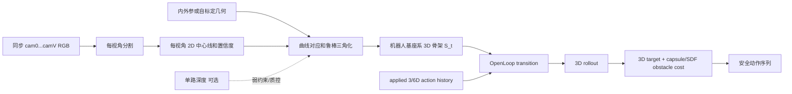
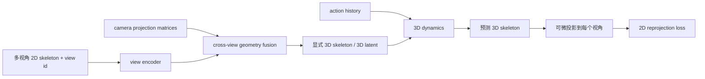
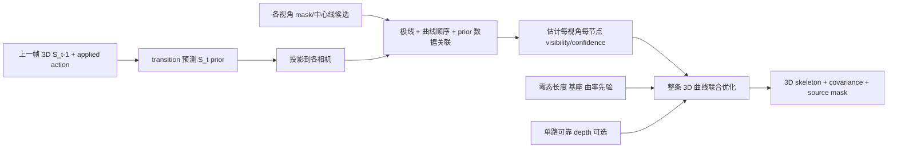
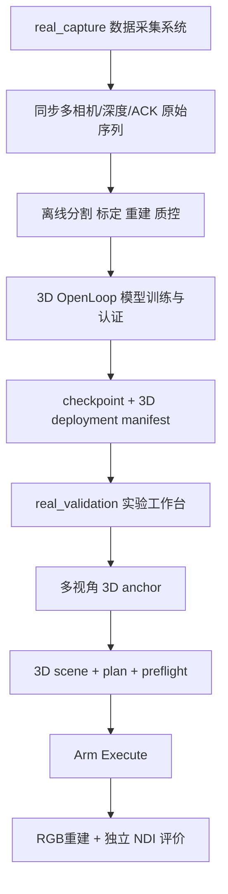

# 实物软体机器人三维形态控制与避障：从二维管线到可验证的 3D OpenLoop

> 日期：2026-08-17
>
> 状态：方案与实施路线；尚未宣称完成三维实机控制
>
> 关联：[多视角 2D→3D](06_multi_view_2d_to_3d_skeleton.md)、[约束导向控制](16_constraint_oriented_control.md)、[路径依赖 IK](17_path_dependent_ik.md)、[多视角自标定](../paper/06_multiview_self_calibration.md)、[实验设计](../paper/04_experiments.md)

## 0. 结论先行

### 0.1 当前二维系统是否足够

当前二维管线足以回答并验证这些问题：

- 严格平面运动下，动作历史是否影响形态预测；
- 单通道或受约束动作下的二维末端到达、二维形态拟合；
- OpenLoop 窗口预测、稀疏重锚定与误差累积；
- 作为三维系统的低成本基线和调试环境。

但它**不足以支撑一般三维全身形态控制和空间避障**。原因不只是坐标少了一个维度：

1. 单视角中，相同二维投影可对应不同的三维形态；
2. 二维投影中“不相交”不等于真实三维安全，投影中“相交”也不一定真实碰撞；
3. 单一标量驱动的可达形态通常只形成一条低维轨迹，无法普遍同时满足“末端到达”和“全身绕障”两个独立约束；
4. 当前 Planner 明确只取 `[:, :, :2]`，障碍也是像素圆/AABB，因此它执行的是二维几何优化。

严格地说，1-DOF 并非对任何障碍都不可能避开：若它唯一的可达路径恰好绕开障碍，仍可能成功。但它通常没有可用于主动绕障的冗余，不能把个例写成一般空间避障能力。

### 0.2 推荐选择

第一版三维主线采用：

> **标定/自标定的同步多视角 RGB → 各视角 2D 骨架 → 带置信度的显式 3D 骨架重建 → 现有 history-conditioned OpenLoop transition → 3D 目标与 3D 障碍规划。**

同时加入“算法中的融合”作为辅助：模型预测三维骨架后，把它投影回所有相机，与各视角二维骨架计算重投影损失。单个深度相机只提供可见节点的弱深度约束、尺度检查和质量门控，不作为唯一全身 GT。

这是一种**前融合为主、训练中融合为辅**的混合方案。它比纯粹把多个二维骨架拼接给网络更容易训练、诊断和用于三维规划。

### 0.3 对整个项目目标的定位

本项目需要保留两条互不替代的证据线：

- **科学主线**：动态/循环加载下的非马尔可夫性、动作历史建模、有限窗口 OpenLoop 与可信视野。这些机制可以先在二维实物数据上完成严格因果验证。
- **能力升级**：3/6 通道、三维全身形态、到达目标同时避障。它验证所学自模型能否解锁真正空间任务，但不能替代前一条机制证据。

因此不应等待整个 3D 系统完成才验证记忆机制，也不应以二维避障图代替论文中的三维空间能力。

---

## 1. 三维任务同时需要“看得见”和“做得到”

三维系统有三个独立条件，必须分别验证。

| 条件 | 核心问题 | 失败时的表象 |
|---|---|---|
| 三维可观测性 | 多相机是否能恢复同一时刻的三维中心线？ | 投影看似正确，深度却漂移；遮挡节点跳变 |
| 三维可控性 | 3/6 个压力输入是否产生足够独立的形态方向？ | action 有 6 维，但有效 Jacobian 仍接近低秩 |
| 规划几何正确性 | 目标、机器人半径和障碍是否在同一度量 3D 坐标系？ | 优化 loss 下降，真实杆段仍穿过障碍 |

“六个阀”只是六维命令，不自动等于六个独立几何自由度。腔体耦合、压力饱和、材料约束可能显著降低有效秩。应在若干代表构型计算或有限差分估计

\[
J_s = \frac{\partial\,\mathrm{vec}(S)}{\partial a},\qquad
J_p = \frac{\partial p_{tip}}{\partial a}
\]

并检查奇异值，而不是只根据阀数量宣称冗余。

对一段三腔机器人，三个腔压常可分解为共同压力与两个差分弯曲方向，但实际是否对应伸长和两个独立弯曲方向需要实验确认。两段六腔通常更有希望在保持末端目标时调整中间形态，因此更适合“到达 + 全身避障”，但仍须用 Jacobian 有效秩和真实执行验证。

---

## 2. 当前仓库已经有什么，真正缺什么

### 2.1 已经可以复用的内容

- `real_capture` 已支持 1–8 台相机、唯一 serial 绑定、同一采样索引的全视图新鲜度检查，并保存 `camN/`、动作与帧时间。
- `scripts/real/capture_to_npz.py` 已串联多视角图像、分割、2D 骨架和三角化。
- `src/data/real/triangulation.py` 已实现基于投影矩阵的多视角 DLT；单相机时另有仅适用于已知平面运动的 planar lift。
- `src/data/real/assemble_npz.py` 已能把 `(T,N,3)` 写为训练端使用的 `positions: (T,3,N)`。
- state-transition/OpenLoop 模型本身一直以三通道节点坐标 `(N,3)` 运算，训练 loader 也能读取真正的 3D `positions`。
- `pc_center/pc_scale` 已是三维 buffer，模型主体不需要因 2D→3D 完全重写。

### 2.2 当前还不构成可靠 3D 管线的原因

- 实物主线数据仍主要是二维像素骨架 `[col,row,0]`；z 不是测量值。
- 当前逐视角骨架按曲线弧长重采样，同一个节点编号在强透视、遮挡或分割缺口下不一定严格对应同一物理截面。
- 当前“每个视图都有新帧”的 freshness 合同不是硬件级同步。动态三角化还必须保存各相机硬件时间戳、测量曝光时刻偏差，并在必要时使用硬件同步或插值到同一时刻。
- DLT 目前没有保存逐节点重投影误差、可见性、协方差或三角化夹角，低质量结果难以从训练中剔除。
- `clean_nan_skeleton` 会沿节点插值，并会把整帧失败置零；这适合防止程序崩溃，却不应把插值值伪装成同置信度 GT。
- 现有 `real_capture/realsense_cam.py` 只启用了彩色流；真实深度保存、对齐和置信度还未接进采集契约。
- 当前 `real_validation` 的 scene、metrics 和 obstacle loss 都是 2D；Planner 还会明确拒绝 `scene.dimension != 2`。
- 当前障碍损失按节点计算。即使简单扩成 3D，两个节点之间的杆段仍可能穿障碍而不被发现。

因此现有代码说明三维升级是**可行的增量工程**，但不能把“已有 DLT 函数”写成“已有三维 GT 系统”。

---

## 3. 两类融合路线应如何理解

### 3.1 路线 A：算法前融合，形成显式 3D 状态（推荐第一版）



优点：

- 状态、目标、障碍和评价共享同一种度量几何语义；
- 可直接延续当前 `(N,3)` transition model 与 OpenLoop 窗口训练；
- 三角化质量和模型误差可以分开诊断；
- Planner 可直接计算毫米级净距；
- 部署时仍可只在窗口开始用多视角重锚定，窗口内使用自模型预测，符合稀疏观察 OpenLoop 主线。

风险：

- 相机几何误差会系统性污染所有 3D 标签；
- 曲线节点对应与自遮挡需要显式处理；
- 两视角都看不见的节点没有三角化 GT。

这里的命名应严格：有已知/估计相机投影几何、至少两个有效视角并通过重投影质控时，结果可以称为“多视角重建的 3D 监督”；没有这些条件，只把正面 x 与侧面 x 拼成坐标，应称为“伪 3D”，不能当度量 GT。

### 3.2 路线 B：算法中融合，多视图投影监督一个 3D latent

更合理的“模型中融合”不是让模型永远只输出二维，而是：



该路线可以在部分节点无法稳定三角化时利用时间动力学和形态先验补全，也允许只用多视角 2D 标注训练。但它必须保留：

- 视角身份；
- 相机投影几何，或经过充分验证的可学习相机模块；
- 一个能交给 3D Planner 的显式三维输出；
- 遮挡和置信度 mask。

只把 `front_2d` 和 `side_2d` 展平后拼接，会让网络自己学习相机几何、节点对应、尺度和动力学，数据需求更大，也更难解释失败原因。对当前实物数据量，它不适合作为第一版主线。

### 3.3 路线 C：每个视角各自做 2D 动力学，再联合规划（只作对照）

可以训练多个二维投影模型，用同一动作序列同时满足各视图中的目标和障碍投影。但它有明显限制：

- 各视图模型可能给出彼此不相容的预测；
- 需要把三维目标和障碍可靠投影到所有视图，本质上仍需要相机几何；
- “某一视图分离”可以作为部分保守安全证据，但多个离散投影不能完整表达一般三维净距；
- 无法自然报告真实空间中的最小间隙和全身误差。

因此它适合作为“2D multi-view baseline”，不建议成为最终三维控制表示。

### 3.4 三条路线比较

| 方案 | 小数据收敛 | 可诊断性 | 遮挡补全 | 3D 规划 | 当前项目改动量 | 定位 |
|---|---:|---:|---:|---:|---:|---|
| 显式重建 3D → transition | 高 | 高 | 中 | 直接 | 中 | **第一版主线** |
| 3D latent + 多视图投影监督 | 中/低 | 中 | 高 | 需显式解码 | 高 | 第二阶段增强 |
| 多个独立 2D 模型联合优化 | 高 | 中 | 低 | 间接且不完备 | 中 | 对照，不作终态 |

最终建议不是二选一，而是：**A 提供可解释的 3D 状态与高置信标签，B 的重投影 loss 利用所有未必能三角化的二维观测。**

---

## 4. 细长 1 cm 机器人如何获得可用的三维监督

### 4.1 主监督：多视角 RGB 中心线重建

细杆对消费级深度相机困难，不代表 RGB 几何不可用。第一版最低配置是：

- 至少两台**同步**相机，建议夹角约 60–90°，避免过小基线；
- 相机固定、曝光锁定、尽量缩短运动模糊；
- 高对比背景或稳定分割；
- 机器人基座在所有视角中可定位，世界坐标统一到机器人基座；
- 传统标定先作为工程基线；身体/场景自标定在它之后做实验对照，而不是一开始同时引入两个未知问题。

相机不必都是深度相机。一台 RealSense 的 RGB 加一台普通同步 RGB 相机，就可以做 RGB 三角化；深度能力只属于其中一个辅助视角。

若物理上真的只有一个相机且机器人发生动态三维运动，则不能仅凭单帧单目得到无先验的真实 3D 中心线。可选方案只有：增加同步视角、增加多点外部跟踪、利用强机器人形态先验，或在可重复的准静态动作下移动相机拍摄。最后一种不适合动态迟滞数据，因为不同时间的图像不是同一状态。

### 4.2 不要把“等弧长编号”直接当精确跨视图对应

推荐逐步升级：

1. 每个视图都确定 `tip → base` 拓扑方向；
2. 用极线约束限制候选对应；
3. 对整条 3D 曲线联合优化，而非每个节点完全独立 DLT；
4. 优化目标同时包含多视图重投影、曲线平滑、相邻段长度变化和固定基座；
5. 输出每节点的可见视图数、重投影误差和协方差；低置信节点保留 mask，不直接冒充 GT。

建议的每帧重建目标为：

\[
\min_{S_t}\sum_{v,j}c_{t,v,j}\,\rho\!\left(\|\pi_v(S_{t,j})-u_{t,v,j}\|\right)
+\lambda_l L_{length}+\lambda_c L_{curvature}+\lambda_b L_{base}
\]

其中 `c` 是分割、可见性与三角化几何共同给出的置信度，`ρ` 用 Huber 等鲁棒损失。

#### 4.2.1 自遮挡时，节点总数固定，但有效观测数允许变化

模型中的节点应定义在固定的规范弧长坐标 `s_j ∈ [0,1]` 上，因此三维状态始终是固定的 `(N,3)`；变化的是每台相机对这些节点的 `visibility/confidence`，而不是随每张图重新定义节点身份。

当前 `extract_skeleton_2d` 会逐图像行取前景质心，再对得到的中心线重新等弧长采样为固定 `N` 点。它不仅要求投影曲线大体沿图像纵向单调，也只保证了数组长度；自遮挡或曲线回折后，`cam0.node_j`、`cam1.node_j` 和前一帧 `node_j` 不一定仍对应同一物理位置。同一行出现两个相隔杆段时，行质心甚至会落在机器人之外。若两个杆段在图像中重合，轮廓的 medial axis 还可能合并、分叉；此时继续按序号 DLT 会产生看似完整但实际错误的三维骨架。

正确的数据语义应为：

```text
固定: model node j / normalized material coordinate s_j
变化: observation[v,j], visibility[v,j], confidence[v,j]
```

对于某个三维节点：

| 有效视角数 | 处理方式 | 训练身份 |
|---:|---|---|
| ≥2 | 鲁棒三角化，并检查重投影/正深度/夹角 | 高或中置信 3D 监督 |
| 1 | 只得到一条相机射线；结合动力学、长度和曲率先验估计 | 单视图约束，不是直接 3D GT |
| 0 | 由上一状态和 action-conditioned dynamics 暂时传播 | `model_completed`，不作观测 GT |

#### 4.2.2 零驱动长度能做什么，不能做什么

可以在零驱动状态采集多帧平均的三维骨架，建立：

- `tip → base` 的固定拓扑方向；
- 规范节点 `s_j`；
- 初始分段长度 `l_j^0`、总弧长和基座位置；
- 各相机中初始节点投影，作为后续跟踪模板。

这些信息非常有用，但长度必须是**软先验或动作相关范围**，不能简单锁死：气动软体机器人可能发生轴向伸长，不同压力下真实分段长度会变化。更重要的是，长度约束只说明相邻节点应相隔多远，无法单独判断图像交叉处哪个杆段在前、哪个在后；多个三维曲线仍可能同时满足相同投影和相同总长度。

若没有材料标记，等弧长节点更准确的名称是“规范化曲线位置”，不一定是严格随材料运动的物质点。若研究需要材料点级动力学，应增加可追踪标记或非刚性曲线配准。

#### 4.2.3 推荐的逐帧遮挡感知重建



联合优化时应使用上一时刻/动作模型作为**关联先验**，而非无条件把模型结果当真值。可见节点由图像修正；不可见节点保留更大的协方差，并在重新出现后重新锚定。

在投影交叉处，一条极线可能与中心线相交多次。候选点应结合以下条件选择：

1. `tip → base` 的曲线顺序单调；
2. 与预测投影的距离；
3. 相邻节点的长度和曲率连续性；
4. 另一视角的重投影一致性；
5. 可选深度的前后顺序。

#### 4.2.4 两台相机何时不够

两台近正交相机的目的不是保证每台都无遮挡，而是让一个视角发生重叠时，另一个视角仍能区分杆段。若同一节点在两台相机中同时被遮挡，纯几何方法当帧无法测得它，只能依赖时序/模型补全。

若实验中频繁出现双视角同时遮挡，解决优先级为：

1. 调整两台相机位置，使预期运动工作空间中的遮挡互补；
2. 在若干已知 `s` 位置增加细小彩色环/荧光点，解决曲线身份和交叉顺序；
3. 增加第三个 RGB 视角；
4. 最后才依赖更强的学习式遮挡补全。

第三台相机往往比复杂网络更直接地改善可观测性。稀疏标记也不要求每个模型节点都有标记：少量锚点可先固定曲线区段，再在区段内按弧长插值；插值节点仍需标记为较低置信度。

### 4.3 单个深度相机的正确角色

约 1 cm 细杆位于深度边缘时，RealSense 容易出现背景泄漏、混合像素、空洞和飞点。不能在二维中心线像素上读取一个 depth 就当真值。建议：

- 先做 RGB-depth 对齐，再只在前景 ROI 内取值；
- 在法向于中心线的小带状邻域中做稳健统计，而不是单像素采样；
- 结合多帧中值/卡尔曼滤波，但动态数据不能用过宽时间窗抹平真实运动；
- 用有效像素比例、局部方差、到背景边界距离生成 `depth_confidence`；
- 只对高置信可见节点施加 depth loss；低置信值设 mask，而非用 0 或邻近背景填充；
- 用深度检查三角化的尺度、前后符号和离群点；不要让它覆盖高质量的多视角几何。

可写成辅助项：

\[
L_{depth}=\sum_{t,j}m^{d}_{t,j}\,w^{d}_{t,j}
\left|d_{cam}(S_{t,j})-\hat d_{t,j}\right|.
\]

### 4.4 NDI 的边界

当前 NDI 是末端毫米级独立评价流。它可以：

- 检查重建尺度、末端 3D 误差和系统漂移；
- 作为相机方案 A/B 的独立交叉验证；
- 若明确改变实验协议，可用于标定或训练末端约束。

但单个末端探头不能提供全身 3D GT。为保持当前实验的隐藏评价语义，默认仍不把 NDI 输入 Planner 或模型；若以后将它用于监督，必须另建实验条件并明确不再是独立评价。

### 4.5 “GT”应分级命名

| 名称 | 含义 | 可否作为主监督 |
|---|---|---|
| `triangulated_3d` | ≥2 视角、相机几何已知、通过重投影质控 | 可以，带 confidence |
| `depth_assisted_3d` | 三角化结果受单路可靠深度辅助 | 可以，带来源 mask |
| `model_completed_3d` | 不可见节点由模型/曲线先验补全 | 可作输入，不应与实测 GT 等权 |
| `planar_lift_3d` | 单目 + 已知运动平面 | 只用于二维/平面基线 |
| `[x,y,0]` | 二维像素占位 | 不能评估三维精度 |

---

## 5. 推荐数据契约

不要只保存最终 `positions`。原始二维证据、相机版本和不确定度必须可追溯：

```text
sequence/
  cam0/, cam1/, ...                 # 原始同步 RGB
  depth_cam0/                       # 可选，不强求每相机有深度
  actions6.csv                      # requested 与 applied/ACK 分开保存
  frame_times.txt
  calibration.npz                   # K, distortion, R, t, frame_id, calib_id
  reconstruction.npz
```

建议 `reconstruction.npz` 至少包含：

```python
positions_3d       # (T, N, 3), float32, robot_base frame, meter
positions_2d       # (T, V, N, 2), float32, [col,row]
visibility         # (T, V, N), bool
keypoint_confidence# (T, V, N), float32
reprojection_error # (T, V, N), pixel
position_covariance# (T, N, 3, 3), optional
source_mask        # (T, N): triangulated/depth-assisted/completed/invalid
depth_values       # (T, N), optional, meter
depth_confidence   # (T, N), optional
actions_requested  # (T, A), kPa
actions_applied    # (T, A), kPa, training主输入
frame_times        # (T,), monotonic seconds
camera_times       # (T, V), optional
camera_params      # (V, ...)
camera_serials     # (V,)
calibration_id
base_frame_T_cam   # 命名约定必须固定
```

为兼容当前 loader，可继续派生：

```python
positions = positions_3d.transpose(0, 2, 1)  # (T,3,N)
actions = normalized(actions_applied)         # (T,A)
```

但派生文件不能丢掉 confidence。训练切分必须以**完整序列/动作轨迹**为单位，不能把相邻帧随机分到 train 和 test。

---

## 6. 三维 transition 训练如何延续当前 pipeline

### 6.1 第一版模型不必重新发明

当前 OpenLoop transition 接收节点的三个坐标，真正需要改变的是数据分布与部署合同：

```text
过去: state_t = [col,row,0], action_dim=1
升级: state_t = [x,y,z] in robot-base meters, action_dim=3 or 6
```

保留：

- 动作历史编码；
- 上一真实 anchor + 窗口内自回归；
- `pc_center/pc_scale` 归一化；
- `H / K_train / K_eval / K_safe` 分离；
- 用真实执行 ACK `applied3/applied6` 更新历史。

必须重训，不能把二维 checkpoint 直接当三维模型继续使用。二维数据可用于预训练分割器、2D 骨架或共享时间编码器，但三维输出头和 dynamics 必须由三维序列监督校准。

### 6.2 推荐损失

\[
L = \lambda_{3d}L_{3d}+\lambda_{repr}L_{repr}
+\lambda_{len}L_{len}+\lambda_{temp}L_{temp}
+\lambda_{base}L_{base}+\lambda_{depth}L_{depth}.
\]

- `L_3d`：按 3D 协方差/置信度加权的节点误差；
- `L_repr`：预测 3D 骨架投影到所有可见视角后的二维误差；
- `L_len`：分段长度或总弧长的软约束，允许真实伸长而非强行固定；
- `L_temp`：速度/加速度一致性，不能替代动作历史建模；
- `L_base`：固定基座漂移惩罚；
- `L_depth`：仅单深度相机高置信节点的辅助项。

重投影 loss 很关键：它使被三角化 mask 丢掉的单视角观测仍能参与训练，也能揭示错误相机参数或错误 3D 标签。

### 6.3 3/6 通道数据不能只做逐通道扫描

逐通道扫描只能学习轴向响应，无法覆盖耦合弯曲和避障规划会访问的组合动作。采集应包含：

- 单通道阶跃/三角波：辨识每个通道和基本迟滞；
- 成对/成组三腔差分激励：覆盖方向耦合；
- 平滑多正弦、分段随机和 Latin-hypercube 目标压力；
- 加载/卸载、不同速率、停留时间；
- 两段之间的联合动作，而非只固定一段扫描另一段；
- 安全边界附近要稀疏探索，不能让随机采样频繁触发危险状态。

训练集应覆盖将来 Planner 可能搜索的 action manifold。否则梯度优化很容易利用模型的 OOD 漏洞找到“模型里安全、真机上错误”的动作。

### 6.4 是否需要带障碍物重新训练 dynamics

若任务要求**无接触避障**，机器人在安全净距外的自由空间动力学与障碍无关：可以用无障碍数据训练 transition，只在规划时加入 3D obstacle cost。这是更干净的因果拆分。

若允许或研究接触，障碍会改变形态动力学，此时必须把环境几何、接触状态/力纳入模型与训练数据；当前 action-history-only transition 不足以描述接触后的状态变化。

---

## 7. 三维目标与避障 Planner 应如何定义

### 7.1 场景坐标与目标

所有原语使用 `robot_base` 度量坐标，而不是某个 camera 的像素：

- `target_point_3d`: `{xyz, node, tolerance_m}`；
- `target_region_3d`: sphere / box / task-space region；
- `target_skeleton_3d`: `{nodes_xyz, node_indices, tolerance_m, weights}`；
- `obstacle_sphere/capsule/aabb/mesh/sdf`；
- 每个对象保存稳定 ID，可作为一个整体平移、旋转、缩放和删除。

部分目标骨架必须显式提供 `node_indices`。这与 GUI 无关，是避免“第 k 个绘制点到底约束模型哪个节点”的数据语义问题。没有映射前，不应放松节点数检查。

### 7.2 多个目标怎么办

当前 Planner 要求恰好一个活动目标，这是合理的第一版约束。三维扩展后可引入任务列表，但必须区分：

- **同时目标**：例如 tip 到球区且中段保持在通道内，作为多个加权/硬约束共同优化；
- **顺序 waypoint**：目标按时间或阶段分配到 rollout 的不同 `k`；
- **候选目标**：多个目标任选其一，应分别规划并比较可达性，而不是把距离简单相加；
- **目标点 + 目标骨架**：若同时生效，tip 点是局部约束，骨架是全身约束；先检查它们是否互相矛盾，并报告残差。

第一版建议仍保持“一个主目标 + 任意多个安全约束”，避免 GUI 看似支持多目标而 Planner 语义含糊。

### 7.3 碰撞不能只检查离散节点

把相邻骨架节点连接为 capsule，并把机器人半径、定位不确定度和安全余量都计入：

\[
r_{effective}=r_{robot}+m_{safety}+k\sigma_{position}.
\]

对每个 rollout 时刻计算所有杆段到障碍 SDF 的最小净距。目标函数可以使用平滑 barrier，但 preflight 必须用明确的硬阈值检查：

```text
predicted_min_clearance > required_clearance
and reconstruction_confidence within certified range
and K <= K_safe
```

三维规划成功至少需要同时报告：末端误差、全身目标误差、最小预测净距、动作是否触及压力/变化率边界，以及多起点规划的一致性。

---

## 8. `real_capture` 与 `real_validation` 的职责



- `real_capture`：高可靠、可追溯地采集训练数据；不承担规划。
- 离线转换：生成三维状态及其置信度；保留原始观测。
- `real_validation`：加载已认证的 checkpoint/合同，获取现场 anchor，编辑三维任务，规划、预检、执行和评价。
- 为便于移植，可把硬件/同步实现复制到 `real_validation`，但行为合同、serial 绑定和质量门控要保持一致；“复制复用”不意味着两个系统职责合并。

NDI 仍走独立评价支路，不能因为画三维 GUI 就无意中进入 Planner 输入。

---

## 9. 分阶段实施路线与 Go/No-Go 闸门

### Phase 0：固定二维基线与三维需求

工作：

- 保留现有 1-DOF 二维模型作为 baseline；
- 明确论文的三维 demo 指标：tip 误差、全身误差、净距、成功率；
- 测量机器人外径、两段长度、压力范围和相机可安装区域。

闸门：若论文只声称平面任务，二维可继续；若声称空间全身避障，后续阶段不可省略。

### Phase 1：静态双/三视角 3D 测量台

工作：

- 先用传统棋盘格标定建立可评估基线；
- 双视角同步 RGB，采集静止和缓慢运动序列；
- 给 DLT 增加极线/重投影/夹角/cheirality 质控；
- 以 NDI tip 交叉验证尺度和末端误差；
- 再比较身体/场景自标定，不同时更换重建和自标定两层。

Go：重投影误差、NDI tip 误差、重复静止形态抖动均达预设阈值，并且不同空间方向没有系统偏差。阈值应由任务所需安全净距倒推，不先拍脑袋固定。

### Phase 2：动态 3/6 通道三维数据集

工作：

- 扩展 `real_capture` 保存深度流（可选）和每相机时间偏差；
- 采集联合动作、循环、速率变化与重复轨迹；
- 输出带 confidence 的 3D reconstruction；
- 按完整轨迹切分 train/val/test。

Go：动态序列的跨视图重投影和 NDI tip 误差未因运动模糊/同步偏差显著失控；每类计划动作域都有覆盖。

### Phase 3：3D OpenLoop transition

工作：

- 使用真实 `(N,3)` 状态和 action_dim=3/6 重训；
- 加入置信度加权 3D loss 与多视图重投影 loss；
- 比较 memoryless、history-conditioned、不同 K；
- 分空间方向报告误差，不能只给平均欧氏误差。

Go：模型在任务 K 内的 3D rollout 误差低于由障碍安全余量分配给模型的误差预算。

### Phase 4：3D Planner 与离线 replay

工作：

- 新增 3D scene contract、capsule/SDF collision 和可达性残差；
- 在 test 轨迹和模型内场景做 reach-only、avoid-only、reach+avoid；
- 比较 1/3/6 action 的有效 Jacobian 秩和任务成功率。

Go：Planner 不依赖 OOD 动作、不遗漏杆段碰撞，并在 held-out replay 中保持净距。

### Phase 5：`real_validation` 三维实机闭环

工作：

- 多视角现场 anchor；
- 3D 对象式场景编辑；
- preflight 检查合同、相机、重建置信度、K、压力与预测净距；
- 低速短 horizon 开始，执行后重新观测并重规划；
- NDI 只做隐藏末端评价。

Go：重复多次真实执行，报告成功率与失败类型；在此之前只可称“模型内规划”或“离线 replay”，不可称已完成真实机器人三维避障。

---

## 10. 文件级修改建议

### 10.1 采集与重建

| 文件/模块 | 建议修改 |
|---|---|
| `real_capture/realsense_cam.py` | 可选启用 depth；RGB-depth 对齐；保存硬件 timestamp、depth scale、有效率 |
| `real_capture/recorder.py` | RGB 全视图同步合同扩展到可选 depth；不能因某一路 depth 无效丢失原始 RGB，但 sample 需记录各模态质量 |
| `scripts/real/capture_to_npz.py` | 输出 2D 节点、visibility、重投影误差、source mask；不要只输出清洗后的 positions |
| `src/data/real/triangulation.py` | 鲁棒曲线重建、畸变后坐标约定、cheirality/夹角/重投影门控、协方差 |
| `src/data/real/preprocess.py` | 插值结果同时输出 imputed mask；整帧失败默认丢弃而非无声置零 |
| `src/data/real/assemble_npz.py` | 保存上述 provenance/confidence 与 `actions_applied` |

### 10.2 训练与认证

| 文件/模块 | 建议修改 |
|---|---|
| `src/data/dataset_spatial.py` | 读取 valid/confidence mask；按置信度训练 |
| transition trainer | 加 3D uncertainty-weighted loss、reprojection loss、方向分解指标 |
| checkpoint manifest | 增加 `state_dimension=3`、`state_frame=robot_base`、单位、calibration/reconstruction 版本、认证的 action domain |
| evaluation | 增加每轴误差、3D tip/full-body、K-by-error、NDI 交叉误差 |

### 10.3 Planner 与验证工作台

| 文件/模块 | 建议修改 |
|---|---|
| `real_validation/contracts/models.py` | 新增明确的 3D primitive schema 和 frame/units，不复用含糊 `xy` |
| `real_validation/planning/obstacles.py` | 由 2D node-circle/AABB 改为 3D capsule-to-SDF/primitive clearance |
| `real_validation/planning/openloop_planner.py` | 建立 2D/3D 明确分支；3D checkpoint 才允许 3D scene；目标 loss 使用 xyz |
| `real_validation/execution/preflight.py` | 检查状态维度、frame、单位、重建置信度、3D clearance 与有效 action domain |
| scene editor | 3D 世界视图 + 至少两个正交投影视图；目标骨架作为单一对象编辑 |
| live anchor | 同步多视角→3D anchor；保留各视图质量和失败原因 |

不能直接删除当前二维 Planner。应保留 `dimension=2` 的已验证路径，新建受合同约束的 `dimension=3` 路径，防止旧 checkpoint 被误用。

---

## 11. 最小充分实验：先回答科学问题，再扩系统

### E1：二维信息是否真的不足

采集两组拥有相近主视角 2D 投影、但侧视深度显著不同的三维形态。比较单视角模型能否区分。若不能，这是升级三维观测的直接证据。

### E2：三角化 GT 是否可信

- 传统标定 vs 自标定；
- 双视角 vs 三视角；
- RGB 三角化 vs RGB + 单路深度辅助；
- 指标：重投影 px、NDI tip mm、静态抖动、有效节点率、遮挡段误差。

### E3：动作维数是否带来真实冗余

在相同 tip 邻域内寻找不同中间形态，比较 1、3、6 通道的 Jacobian 奇异值、可达形态体积和目标保持下的障碍净距。不要只比较 action_dim 数字。

### E4：3D dynamics 的记忆机制

在 3/6 通道循环与变速轨迹上比较无记忆与 history-conditioned OpenLoop，按 x/y/z 和加载方向分别报告。这样三维升级仍服务于论文的非马尔可夫核心问题。

### E5：真正的“到达 + 避障”

至少包含：

- reach-only；
- avoid-only；
- reach+avoid；
- 无障碍 loss、二维投影障碍 loss、完整三维 loss 对照；
- 单段 3 通道与两段 6 通道对照（若硬件均可用）；
- 模型预测净距 vs 多视角执行后重建净距；
- NDI terminal tip error。

只有 E5 的真实执行通过后，才能写“真实机器人三维全身避障”。

---

## 12. 最终决策

1. **不要放弃现有二维 pipeline**：它是记忆/OpenLoop 科学问题的快速、干净基线。
2. **若论文目标包含空间形态控制与全身避障，三维状态和 3/6 通道数据是必要升级**；只改 GUI 不够。
3. **第一版以同步多视角 RGB 的显式 3D 骨架为主状态**，传统标定先建立基准，自标定随后作为研究增强。
4. **单路深度是辅助监督和质量传感器，不是唯一 GT**；细杆深度失效处保留 uncertainty/mask。
5. **训练中加入多视图重投影监督**，但 Planner 最终仍消费显式 3D 骨架与度量障碍。
6. **动作空间从 1 升至 3/6 后必须重新设计联合激励数据并验证有效秩**；阀数量本身不证明冗余。
7. **先完成 3D 测量可信度，再训练 3D dynamics，再改 3D Planner/GUI**。这个顺序能避免把观测误差、模型误差和规划误差混在一起。

推荐的最短可行路径是：

```text
双相机传统标定基线
→ 静态/慢速双视角 3D + NDI tip 验证
→ 3通道单段联合动作小数据集
→ 现有 OpenLoop transition 的真实 (N,3) 重训
→ sphere obstacle + capsule arm 的离线 3D planner
→ 短 horizon 实机 reach+avoid
→ 再扩到两段6通道、自标定和遮挡鲁棒融合
```

它不是功能最多的路线，但每一步都有可判定的实验结果，并且任何阶段失败时都能知道失败属于观测、可控性、动力学还是规划几何。
