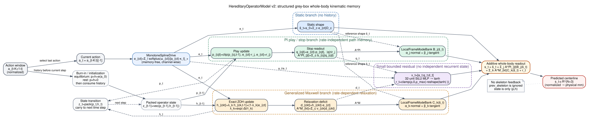

# HereditaryOperatorModel v2：理论基础、结构边界与可检验含义

> 适用实现：`src/models/model_hereditary_operator.py`（Version B）
> 文献元数据核验：Crossref 与 OpenAlex，2026-08-31

## 摘要

`HereditaryOperatorModel` v2（下称 HOV2）是一个面向真实气动软臂全身中心线预测的、流变学启发的结构化灰箱运动学模型。它把历史依赖限制在两组有限维、可递推的内部状态中：Prandtl–Ishlinskii（PI）play 状态及其 stop 读出表示率无关路径记忆，广义 Maxwell 状态表示率相关松弛；当前动作经逐通道单调映射成为共同驱动，内部状态再通过随当前静态构形旋转的局部标架模态，加性地读出为全身位移。小型神经残差只接收当前动作和显式算子读出，不拥有独立的循环状态。

这一构造的价值不是把经典算子嵌入神经网络本身作为新方法，而是把软臂的全身形态记忆从不可读的时序特征变成可干预、可消融、可与独立实验互相裁决的状态坐标。必须同时强调：当前已实现的 Version B 不是从三维连续介质热力学严格推导的材料本构模型，也不直接识别材料松弛模量或材料迟滞密度。它描述的是“动作—整臂中心线”层面的输入输出运动学；阀流量、腔室充放气、结构几何、材料黏弹性、摩擦和观测坐标均可能共同进入所辨识的记忆。因此，合适的术语是 **whole-body kinematic memory fingerprint（全身运动学记忆指纹）**。

论文风格的实现级信息流图见图 1。图中四条输出支路严格相加；只有 PI
状态 (p) 与 Maxwell 状态 (h) 进入下一时刻，预测骨架不反馈回模型。

**图 1.** HOV2 的动作到全身中心线信息流。实线表示当前步的前向读出，虚线
表示参考形状、残差输入或跨时刻状态传递；`equilibrium/rest` 只影响窗口起点
的状态烧入。

## 1. 模型对象、符号与证据等级

设离散时刻为 \(t\)，采样周期为 \(\Delta t\)；\(C\) 为动作通道数，\(N\) 为中心线节点数，\(J\) 为 PI 阈值数，\(M\) 为 Maxwell 时间尺度数。归一化动作记为 \(\alpha_t\in[0,1]^C\)，逐通道伪驱动记为 \(e_t\in\mathbb R^C\)；PI 的 play 状态与 stop 读出分别为 \(p_t\in\mathbb R^{C\times J}\) 和 \(q_t\in\mathbb R^{C\times J}\)，Maxwell 状态与亏量分别为 \(h_t\in\mathbb R^{C\times M}\) 和 \(d_t\in\mathbb R^{C\times M}\)；预测中心线为 \(s_t\in\mathbb R^{N\times3}\)。实现采用平面合同，第三坐标为零或仅由静态项、残差的接口维度保留。

本文为每个编号公式标注以下证据等级：

- **直接推导**：由所列经典方程或基本数值离散严格得到，未改变其数学含义。
- **结构迁移**：把已有力学、算子或数值结构迁移到“动作—全身中心线”的灰箱映射；形式有文献先例，但不是对当前软臂材料本构的直接推导。
- **本工作设计**：为满足当前数据合同、可辨识性或部署接口而作的具体架构选择，其有效性需要实验验证。

## 2. 总模型：有限内部状态上的灰箱全身运动学

HOV2 的一步输出为

\[
\boxed{
s_t=\widetilde s_t
+\sum_{j=1}^{J}\left(\sum_{c=1}^{C}b_{cj}q_{cjt}\right)B_j(\widetilde s_t)
+\sum_{k=1}^{M}\left(\sum_{c=1}^{C}v_{ck}d_{ckt}\right)C_k(\widetilde s_t)
+r_\theta(\alpha_t,q_t,d_t)
},\qquad d_{ckt}=h_{ckt}-e_{ct}.
\tag{1}
\]

> 来源与证据等级：Simo（1987）、Reese 与 Govindjee（1998）的内部变量思想，以及 Psichogios 与 Ungar（1992）、Karniadakis 等（2021）的机理—学习混合建模范式；**【结构迁移 + 本工作设计】**。式（1）是全身运动学读出，不是有限应变本构方程。

其中 \(b_{cj}\ge 0\)，\(v_{ck}\) 可带符号；\(B_j,C_k\in\mathbb R^{N\times3}\) 是依赖当前静态参考形状的局部标架模态。式（1）的关键限制是严格加性：静态、PI、Maxwell 和残差四个分量在输出层相加，PI/Maxwell 状态不反馈给静态映射，也不存在另一个 GRU/LSTM 隐状态。因而“将某一族状态置零”的干预在数学上是良定义的；但加性本身并不保证各分量可辨识，尺度自由度和激励不足仍会产生等价分解。

静态参考形状为

\[
\widetilde s_t=s_0+\sum_{c=1}^{C}e_{ct}D_c,
\qquad s_0,D_c\in\mathbb R^{N\times3}.
\tag{2}
\]

> 来源与证据等级：低秩线性形状基是常用运动学参数化；逐通道无记忆限制与无跨通道 MLP 是 HOV2 的可解释性约束；**【本工作设计】**。

式（2）只依赖当前动作，故不能单独储存历史。它不是软臂真实静态平衡方程；它是在归一化中心线空间中的容量受限基线。不同通道仍可通过输出形状方向 (D_c) 在空间上叠加，但驱动标量在静态映射之前不被任意网络混合。

## 3. 逐通道单调驱动：从动作到伪驱动

每个动作通道使用非负铰链样条

\[
e_c(\alpha_c)=\sum_{\ell=1}^{L}w_{c\ell}[\alpha_c-\kappa_\ell]_+,
\qquad
w_{c\ell}=\operatorname{softplus}(\omega_{c\ell})\ge 0,
\qquad [x]_+=\max(x,0).
\tag{3}
\]

> 来源与证据等级：Ramsay（1988）的单调回归样条思想提供非负基系数保证单调性的依据；逐通道 hinge 参数化、节点数与归一化动作域为当前实现选择；**【结构迁移 + 本工作设计】**。

由式（3）可得几乎处处

\[
\frac{\partial e_c}{\partial \alpha_c}
=\sum_{\ell=1}^{L}w_{c\ell}\mathbf 1(\alpha_c>\kappa_\ell)\ge 0,
\qquad
\frac{\partial e_c}{\partial \alpha_{c'}}=0\quad(c'\ne c).
\tag{4}
\]

> 来源与证据等级：由式（3）逐项求导；**【直接推导】**。

因此驱动是记忆无关、逐通道和单调不减的。\(e_c\) 在模型中应称“伪驱动”或“伪应变代理”，而不能自动解释为材料应变：当前输入是归一化动作，不是材料点的应变测量；动作到实测腔压、腔压到弯矩、弯矩到全身构形的非线性都可能被式（3）和空间模态共同吸收。

## 4. PI play/stop 组：率无关路径记忆

对每个通道 \(c\) 与固定阈值 \(r_j>0\)，实现先更新 play 状态，再读取有界 stop 变量：

\[
p_{cjt}=\operatorname{clip}\!\left(
p_{cj,t-1},\ e_{ct}-r_j,\ e_{ct}+r_j
\right),
\qquad
q_{cjt}=e_{ct}-p_{cjt},
\qquad |q_{cjt}|\le r_j.
\tag{5}
\]

> 来源与证据等级：PI play/stop 算子的标准递推及其循环神经表示见 Krikelis 等（2021）；软体气动执行器中的 PI 应用见 Al Saaideh 与 Al Janaideh（2022）和 de la Morena 等（2025）；逐通道共享阈值网格是 HOV2 的迁移方式；**【直接推导（标量算子）+ 结构迁移（多通道全身读出）】**。

式（5）不含 Δt。若同一输入折线路径只改变各段经历时间、而不改变依次到达的输入顶点，则状态在对应顶点相同，这就是该离散算子的率无关性。\(q\) 是**电平量**而非位移增量；恒定输入下它保持某个历史相关常数，因此在式（1）中作为电平位移贡献读取，不做时间累加。PI 分量的非负幅值参数化为

\[
b_{cj}=\operatorname{softplus}(\beta_{cj})\ge0,
\qquad
A^{\mathrm{PI}}_{jt}=\sum_{c=1}^{C}b_{cj}q_{cjt}.
\tag{6}
\]

> 来源与证据等级：非负 PI 权重符合经典 PI 叠加的构造；用共享空间模态 (B_j) 读取逐通道 stop 幅值是 HOV2 设计；**【结构迁移 + 本工作设计】**。

非负 \(b\) 抑制同一 PI 字典内的正负抵消，但不消除 \(b_{cj}\) 与 \(B_j\) 的尺度自由度，也不使 \(b_{cj}/r_j\) 自动成为材料 PI 密度。其可解释边界在第 10 节给出。

## 5. 广义 Maxwell 组：率相关松弛与精确 ZOH

HOV2 把每个 Maxwell 内部变量写成对伪驱动的单位增益一阶追踪器：

\[
\tau_k\dot h_{ck}(t)+h_{ck}(t)=e_c(t),
\qquad \tau_k>0.
\tag{7}
\]

> 来源与证据等级：广义 Maxwell/内变量黏弹性思想见 Simo（1987）、Reese 与 Govindjee（1998）；软致动器中的多尺度耗散与率相关迟滞证据分别见 Gu 等（2017）和 Ru 等（2022）；将其输入改为伪驱动、输出改为全身运动学模态属于迁移；**【结构迁移】**。

若一个采样区间内 \(e_c(t)=e_{ct}\) 按零阶保持，则式（7）的精确离散解为

\[
h_{ckt}=\lambda_k h_{ck,t-1}+(1-\lambda_k)e_{ct},
\qquad
\lambda_k=\exp(-\Delta t/\tau_k)\in(0,1).
\tag{8}
\]

> 来源与证据等级：对式（7）在常值输入下积分得到的精确 ZOH 解；**【直接推导】**。

精确 ZOH 对任意 Δt/τ 都保持 \(0<\lambda_k<1\)，避免显式 Euler 在大步长下的数值不稳定。实现把 τ 固定在对数网格上，并令最短时标不小于 \(3\Delta t\)，以避免比采样分辨率更快的模态与静态通道混淆。有限指数和近似宽时标核的数学依据可联系 Beylkin 与 Monzón（2005），但当前有限网格只表示所覆盖时间带内的截断记忆，不能声称无限记忆或已经识别连续材料谱。

Maxwell 通过相对当前目标的亏量读取：

\[
d_{ckt}=h_{ckt}-e_{ct},
\qquad
A^{\mathrm M}_{kt}=\sum_{c=1}^{C}v_{ck}d_{ckt}.
\tag{9}
\]

> 来源与证据等级：平衡态内变量与当前驱动之差为零，源于式（7）—（8）；将该亏量以带符号权重投影到全身模态是 HOV2 的读出设计；**【直接推导（零稳态亏量）+ 本工作设计（运动学投影）】**。

当输入保持为常数 \(e_c^\star\) 时，\(h_{ck}\to e_c^\star\)，故 \(d_{ck}\to0\)。因此 Maxwell 通道只表示相对静态参考形状的瞬态偏离，不与式（2）的平衡响应重复计数。\(v_{ck}\) 允许带符号，因为形状响应相对局部模态的方向可以相反；但这也进一步要求对尺度和符号不唯一性作审慎处理。

## 6. 平衡初始化：Maxwell 稳态与 play 中性约定必须区分

默认 `equilibrium` 烧入对窗口首动作 α_0 采用

\[
h_{ck,0}=e_c(\alpha_{c0}),
\qquad
p_{cj,0}=e_c(\alpha_{c0}),
\qquad
d_{ck,0}=q_{cj,0}=0.
\tag{10}
\]

> 来源与证据等级：\(h=e(\alpha_0)\) 是式（7）的常输入稳态，属**【直接推导】**；\(p=e(\alpha_0)\) 是选取 zero-offset 的 neutral convention，属**【本工作设计】**，不是 play 算子的唯一物理平衡。

这两个等号虽然数值形式相同，含义不同。对 Maxwell 状态，常输入稳态由式（7）唯一给出 \(h=e\)。对 play 状态，在常输入 \(e^\star\) 下，所有满足

\[
p_{cj}\in[e_c^\star-r_j,\ e_c^\star+r_j]
\quad\Longrightarrow\quad
\operatorname{clip}(p_{cj},e_c^\star-r_j,e_c^\star+r_j)=p_{cj}
\tag{11}
\]

> 来源与证据等级：由 clip 映射的不动点集合直接得到；**【直接推导】**。

因此 play 在死区内存在连续不动点集合，具体状态取决于到达该输入的历史。令 \(p=e(\alpha_0)\) 只是选择 \(q=0\) 的零偏置参考，适合“窗口开始前未观测的迟滞偏移设为中性”的数据合同；它不能被描述为 play 的唯一物理平衡、virgin state 或真实装置在任意驻留后的必然状态。

实现的状态语义是“已经消费到 (t-1) 的输入”。初始化时先按式（10）设置窗口首值，再递推窗口中除当前动作外的其余历史；首个 `forward` 才消费窗口最后一个动作。这个约定避免同一动作被重复更新。若使用跨片段 rollout，上一时刻打包状态直接传入，初始化不再重复发生。

## 7. 局部标架模态：随静态构形旋转的全身位移基

对静态参考中心线的第 \(n\) 个节点，先用相邻节点差分构造单位切向 \(T_{nt}\)，再在平面内旋转 \(90^\circ\) 得到法向 \(N_{nt}\)：

\[
\bar T_{nt}=\begin{cases}
\widetilde s_{2t}-\widetilde s_{1t}, & n=1,\\
\tfrac12(\widetilde s_{n+1,t}-\widetilde s_{n-1,t}), & 1<n<N,\\
\widetilde s_{Nt}-\widetilde s_{N-1,t}, & n=N,
\end{cases}
\quad
T_{nt}=\frac{\bar T_{nt}}{\max(\|\bar T_{nt}\|_2,\varepsilon)},
\quad
N_{nt}=(-T_{nt,y},T_{nt,x},0).
\tag{12}
\]

> 来源与证据等级：随构形旋转的共转/局部标架思想见 Felippa 与 Haugen（2005）；中心差分、端点单侧差分及平面法向是当前骨架合同下的具体实现；**【结构迁移 + 本工作设计】**。

第 ℓ 个模态写为

\[
\Phi_{\ell nt}(\widetilde s_t)
=a_{\ell n}N_{nt}+\gamma_{\ell n}T_{nt},
\qquad
B_j=\Phi_j,\quad C_k=\Phi_k,
\tag{13}
\]

> 来源与证据等级：局部切—法向分解继承共转坐标思想；每个记忆尺度配置独立、可学习的节点幅值是 HOV2 设计；**【结构迁移 + 本工作设计】**。

该构造使同一记忆模态在大弯曲下随臂的当前静态构形旋转，而不是固定在全局坐标方向。它仍然是中心线空间的运动学基，不是由截面应力积分、Cosserat 平衡或边界条件求得的力学本征模态；“mode”在此应理解为可学习的局部位移场。

## 8. 小型有界神经残差与加性边界

残差由当前动作、PI stop 读出与 Maxwell 亏量组成的向量驱动：

\[
r_\theta(\alpha_t,q_t,d_t)
=\bar\rho\,\operatorname{reshape}\!\left[
\tanh\!\left(W_2\,\operatorname{SiLU}(W_1x_t+c_1)+c_2\right)
\right],
\quad
x_t=[\alpha_t;q_t;d_t].
\tag{14}
\]

> 来源与证据等级：机理结构与小型神经修正的灰箱组合见 Psichogios 与 Ungar（1992）及 Karniadakis 等（2021）；输入限制、32 单元隐藏层和加性读出为 HOV2 设计；**【结构迁移 + 本工作设计】**。

由于 tanh 的值域为 \((-1,1)\)，对给定标量 \(\bar\rho\) 有逐坐标界 \(\|r_\theta\|_\infty\le|\bar\rho|\)。当前代码取 `bar_rho = clamp(residual_scale, max=residual_scale_max)`；因此在预期的非负幅度约定 \(0\le\bar\rho\le\rho_{\max}\) 下有严格界 \(\|r_\theta\|_\infty\le\rho_{\max}\)。审稿与发布检查应同时报告训练后 `residual_scale` 的符号和值：现实现只做上侧截断，若参数被训练为负值，则仍有 tanh 的有限输出界，但不能仅凭代码断言其绝对幅度不超过 \(\rho_{\max}\)。

残差没有额外历史窗口编码器或循环隐状态，所以它不能绕开 \(p,h\) 私藏另一条长期记忆；但它可以非线性混合 \(q,d\)，也可能吸收未建模的当前状态依赖。因而残差应报告物理单位下的 realized mm-RMS、相对总预测能量以及消融性能，而不能只报告标量 \(\bar\rho\)。

## 9. 有限内部状态的 Markov 性与 BPTT

将全部算子状态打包为

\[
z_t=\operatorname{vec}(p_t,h_t)\in\mathbb R^{C(J+M)},
\qquad
z_t=F(z_{t-1},\alpha_t),
\qquad
s_t=G(z_t,\alpha_t).
\tag{15}
\]

> 来源与证据等级：有限维状态空间定义及式（5）、（8）的组合；**【直接推导】**。

因此 HOV2 在增广状态 \(z_t\) 上是给定动作 \(\alpha_t\) 的有限维一阶 Markov 模型。仅观察 \(s_t\) 或仅观察当前动作时，未来可以因隐藏的 \(p_t,h_t\) 不同而不同；这不等于模型“非 Markov”。正确表述是：历史依赖被压缩到有明确算子结构的有限内部状态中，所需状态数、阈值带和时间尺度带是待辨识对象。每步计算和状态存储均与已历历史长度无关，为 \(O(C(J+M))\)。

对长度 \(T\) 的 episode 损失，BPTT 使用链式法则穿过状态递推：

\[
\frac{\mathrm d\mathcal L}{\mathrm d\theta}
=\sum_{t=1}^{T}
\left[
\frac{\partial \ell_t}{\partial \theta}
+\frac{\partial \ell_t}{\partial z_t}
\sum_{\nu=1}^{t}
\left(\prod_{m=\nu+1}^{t}
\frac{\partial F_m}{\partial z_{m-1}}
\right)
\frac{\partial F_\nu}{\partial \theta}
\right].
\tag{16}
\]

> 来源与证据等级：循环状态空间模型的链式法则；将可微 play/stop 算子嵌入循环网络并用 BPTT 辨识的直接先例见 Krikelis 等（2021，2024）；**【直接推导 + 结构迁移】**。

Maxwell 更新和神经读出是光滑的；clip/ReLU 在分段内部可微，在阈值折点使用自动微分框架选定的次梯度。当前训练以 episode 序列损失监督中心线及相邻节点差分，算子状态经 `latent_z` 在 episode 内传递。由于模型不读取上一帧骨架，teacher forcing 与自回归骨架反馈对其状态转移没有区别；真正影响长期记忆学习的是 episode 长度、状态是否跨截断延续、初始化协议以及训练激励对 τ/r 网格的覆盖。

## 10. 可解释量的边界：从 raw 权重到全身运动学记忆指纹

### 10.1 为什么 raw \(|v|\) 或 \(b/r\) 不是材料谱

式（1）只通过权重与空间模态的乘积影响输出。对任意非零标量 ξℓ，存在尺度变换

\[
b_{c\ell}'=\xi_\ell b_{c\ell},\quad
B_\ell'=B_\ell/\xi_\ell;
\qquad
v_{c\ell}'=\xi_\ell v_{c\ell},\quad
C_\ell'=C_\ell/\xi_\ell,
\tag{17}
\]

> 来源与证据等级：由式（1）的双线性乘积不变性直接得到；**【直接推导】**。

只要变换不违反 \(b\ge0\)（例如 \(\xi>0\)），预测完全不变而 raw 权重改变。驱动侧也存在相似自由度：若 \(e\) 的幅值尺度改变，阈值 \(r\)、静态方向、读出权重与模态可协同补偿。再加上输入是动作而非材料应变、输出是全身中心线而非应力，`abs(v)`、`b/r`、网格质量或某一模态的 raw 范数都不能直接称为材料松弛谱、材料损耗谱或材料 PI 密度。

推荐名称是：在明确模型、动作归一化、采样周期、网格和初始化协议条件下的 **whole-body kinematic memory fingerprint**。它是整机输入输出属性的模型化摘要，只有经外部实验裁决后才能作更具体的机理解释。

### 10.2 使解释更强所需的报告协议

第一，必须固定或报告 mode normalization。可将每个 \(B_j,C_k\) 在代表性静态构形集合上归一到单位节点 RMS，再把尺度吸收到相应通道权重；也可直接报告组合贡献而不解释裸权重。无论采用哪种方式，训练、跨 seed 与跨数据集比较必须使用同一规范。

第二，必须报告 realized contribution，而非只列参数。建议在验证集物理坐标中分别计算 PI、Maxwell、残差贡献的节点 mm-RMS、峰值、时间序列相关矩阵和相对总预测位移的比例。

第三，分量归因需用 leave-one-component-out（LOO）重评估或子集重拟合；若要给“份额”，应使用对顺序无关的 Shapley 分解并报告相关份额。仅把式（1）各项方差直接相除，在分量相关时会产生误导。

第四，必须做跨随机 seed、阈值/时间常数半格偏移和静态容量变化的稳定性检验。稳定对象优先是聚合量（例如某一 τ 频段的 realized mm-RMS、总 PI 环面积贡献），而非单个网格点权重。

第五，训练与验证输入应优先采用实测腔压。若只用阀指令，所得记忆指纹包含阀限流与腔室充放气动态，不能与材料流变学分离。实测腔压仍不等于材料应力，但能去除一个关键执行器动态混杂块。

第六，必须采集多速率、hold–release 和同压异程协议。重复同一几何路径但改变时间尺度，可检验 PI 的率无关项；log-spaced hold–release 可约束 Maxwell 时间带；训练未见速率与保持时长上的外推，才是“指纹具有预测含义”而非“网络拟合权重可视化”的证据。

## 11. 可检验预测与证伪条件

以下预测来自模型结构，而非训练误差的同义改写。

1. **保持松弛**：动作或实测腔压进入恒定平台后，Maxwell 亏量按 τk 的指数和衰减到零；静态项保持，PI stop 项保持历史相关常值。若观测到无法由所覆盖 τ 带解释的持续幂律尾部或漂移，有限 Maxwell 网格需要扩带/增阶，或模型类不充分。
2. **时间缩放分离**：相同输入折线路径在不同速度下，PI 状态在对应路径顶点应一致；Maxwell 贡献随速度改变。若归一化到相同路径后所谓 PI realized contribution 强烈随速度漂移，则 PI/Maxwell 分解、驱动测量或初始化存在混杂。
3. **同输入异历史**：从加载侧与卸载侧到达相同当前输入时，静态参考形状相同，而 (p,h) 可不同，故预测全身形状不同。长时间保持后 Maxwell 差异应消失，PI 差异可以保留。
4. **平衡初始化检验**：若数据窗口首帧确为充分驻留且零偏置可复现，equilibrium 初始化应减少慢 Maxwell 的人为冷启动瞬态；若装置在窗口前保留未知 play 历史，则 \(p=e(\alpha_0)\) 会系统性低估初始迟滞偏置，可通过预条件化协议或更长可观测前缀证伪。
5. **局部标架协变性**：对相似静态构形的整体平面旋转，局部模态贡献应随切—法向标架旋转，而不固定在图像全局轴。若旋转/大曲率子集上误差显著增大，应检查平面合同、节点序与静态参考切向退化。
6. **阈值与幅值扫描**：小于某些 (r_j) 的闭合输入扰动不应激活相应 stop 饱和切换；随着路径幅值跨越更多阈值，PI 环面积及 realized contribution 应出现可复现的幅值依赖。
7. **结构消融**：PI-only 应更难解释速度相关 hold–release，Maxwell-only 的准静态环面积应随足够慢的速度趋小；完整模型若确有必要，应在训练未见的多速率/保持协议上同时优于两者。若完整模型优势只出现在训练分布内，则结构解释不成立。
8. **跨 seed 可重复性**：在 mode normalization 后，时间带/阈值带的聚合 realized contribution 应跨 seed 稳定。若裸权重稳定而物理贡献不稳定，或反之，应以输入输出贡献和外部实验预测为最终裁决。

## 12. 与严格材料本构、黑箱时序模型及已有算子网络的关系

Simo（1987）与 Reese 和 Govindjee（1998）讨论的是满足连续介质运动学与热力学约束的有限应变黏弹性：内部变量位于应力、弹性/非弹性变形等物理空间，并与客观率、耗散不等式、边界值问题相连。HOV2 Version B 借用了“有限内部变量 + 多时间尺度 + 平衡/非平衡分离”的结构思想，但其状态作用在伪驱动到中心线的运动学读出上，没有材料点变形梯度、应力、自由能或耗散证明。因此，不能把 (p,h,b,v) 逐项等同于材料滑移、黏性应变、模量或顺度。

Gu 等（2017）、Ru 等（2022）、Al Saaideh 与 Al Janaideh（2022）以及 de la Morena 等（2025）表明，软致动器中率相关黏弹性、率无关/弱率相关迟滞和多尺度松弛具有充分的对象层动机；但这些工作多面向单致动器标量位移、角度或力。HOV2 的迁移点是直接预测 (N) 节点全身中心线，并让每个记忆尺度对应一个随构形旋转的全身位移场。

Krikelis 等（2021，2024）已经证明 play/stop 算子可写成可微循环单元、用 BPTT 与动力学块联合辨识。因此，本工作不把“可微 PI 算子嵌入网络”作为方法新颖性。Liu 等（2024）的 BiLSTM–MLP 则代表高容量隐式时序建模路线：它可能获得优良拟合，但内部记忆难以与独立的速率—保持实验直接对齐。HOV2 的目标不是预设其必然比黑箱更精确，而是以更强结构限制换取状态干预、跨协议预测和可审计的记忆分解。

## 13. 论文可直接使用的方法定位段

> 我们采用一种流变学启发的结构化灰箱全身运动学模型，将气动软臂的历史依赖限制在两类显式内部状态中：逐通道 Prandtl–Ishlinskii stop 组表示率无关路径记忆，固定对数时间网格上的广义 Maxwell 组以精确零阶保持离散表示率相关松弛。当前动作首先经过容量受限的逐通道单调映射；静态形状仅依赖当前驱动，PI 与 Maxwell 状态则通过随静态中心线局部切—法向标架旋转的位移模态严格加性读出。一个小型 tanh 残差只接收当前动作与显式算子读出，不具有独立循环记忆。有限算子状态使模型在增广状态上保持 Markov，并允许通过 BPTT 进行端到端序列辨识。该模型不是严格材料本构，其参数被解释为特定驱动、观测与模型规范下的全身运动学记忆指纹；我们通过模态归一化、物理单位 realized contribution、LOO/Shapley 消融、跨随机种子稳定性以及独立的多速率 hold–release 实验检验这一解释。

可配套使用的贡献定位如下：

> 我们不主张 PI/stop 算子的神经网络嵌入本身具有新颖性；已有工作已经给出可微循环实现和 BPTT 联合辨识。本文的新颖性主张限定在研究对象和闭环证据：把真实软体机器人的全身形态记忆作为显式、可干预的测量对象，使模型内部的率无关与率相关贡献接受训练外、多速率和保持—释放实验的外部裁决，并研究这些记忆坐标对稀疏观测开环预测与部署的意义。

## 14. 实现—理论对应表

| 理论构件 | 当前实现 | 审稿时应核对 |
|---|---|---|
| 单调伪驱动，式（3） | `MonotoneSplineDrive` | 动作归一化范围、各通道曲线与有效斜率 |
| PI play/stop，式（5） | `PlayBank.step` | \(r\) 覆盖、阈值边缘质量、初始化协议 |
| Maxwell ZOH，式（8） | `MaxwellBank.step` | \(\Delta t\) 合同、\(\tau\) 可辨识带、episode/截断状态连续性 |
| 局部模态，式（12）—（13） | `LocalFrameModeBank` | 节点顺序、平面合同、退化切向、mode normalization |
| 加性读出，式（1） | `HereditaryOperatorModel.forward` | 分量 realized mm-RMS、相关性、LOO/Shapley |
| 平衡烧入，式（10） | `_burn_in(..., equilibrium)` | Maxwell 稳态与 play neutral convention 的不同含义 |
| 增广状态，式（15） | `latent_z = pack(p,h)` | 当前动作只消费一次、跨片段状态是否按协议传递 |
| BPTT，式（16） | episode training path | 序列长度、梯度穿透、阈值折点与跨 seed 稳定性 |
| 神经残差，式（14） | two-layer SiLU–tanh readout | `residual_scale` 的值/符号、realized mm-RMS、消融 |

## 参考文献

1. Simo, J. C. (1987). *On a fully three-dimensional finite-strain viscoelastic damage model: Formulation and computational aspects*. Computer Methods in Applied Mechanics and Engineering, 60(2), 153–173. [https://doi.org/10.1016/0045-7825(87)90107-1](https://doi.org/10.1016/0045-7825(87)90107-1)
2. Reese, S., & Govindjee, S. (1998). *A theory of finite viscoelasticity and numerical aspects*. International Journal of Solids and Structures, 35(26–27), 3455–3482. [https://doi.org/10.1016/S0020-7683(97)00217-5](https://doi.org/10.1016/S0020-7683(97)00217-5)
3. Gu, G.-Y., Gupta, U., Zhu, J., Zhu, L.-M., & Zhu, X. (2017). *Modeling of viscoelastic electromechanical behavior in a soft dielectric elastomer actuator*. IEEE Transactions on Robotics, 33(5), 1263–1271. [https://doi.org/10.1109/TRO.2017.2706285](https://doi.org/10.1109/TRO.2017.2706285)
4. de la Morena, J., Ramos, F., & Vázquez, A. S. (2025). *Hysteresis modeling of soft pneumatic actuators: An experimental review*. Actuators, 14(7), 321. [https://doi.org/10.3390/act14070321](https://doi.org/10.3390/act14070321)
5. Al Saaideh, M., & Al Janaideh, M. (2022). *On Prandtl–Ishlinskii hysteresis modeling of a loaded pneumatic artificial muscle*. ASME Letters in Dynamic Systems and Control, 2(3). [https://doi.org/10.1115/1.4054779](https://doi.org/10.1115/1.4054779)
6. Ru, H., Huang, J., Chen, W., & Xiong, C. (2022). *Modeling and identification of rate-dependent and asymmetric hysteresis of soft bending pneumatic actuator based on evolutionary firefly algorithm*. Mechanism and Machine Theory, 181, 105169. [https://doi.org/10.1016/j.mechmachtheory.2022.105169](https://doi.org/10.1016/j.mechmachtheory.2022.105169)
7. Krikelis, K., van Berkel, K., & Schoukens, M. (2021). *Artificial neural network hysteresis operators for the identification of Hammerstein hysteretic systems*. IFAC-PapersOnLine, 54(7), 702–707. [https://doi.org/10.1016/j.ifacol.2021.08.443](https://doi.org/10.1016/j.ifacol.2021.08.443)
8. Krikelis, K., Pei, J.-S., van Berkel, K., & Schoukens, M. (2024). *Identification of structured nonlinear state–space models for hysteretic systems using neural network hysteresis operators*. Measurement, 224, 113966. [https://doi.org/10.1016/j.measurement.2023.113966](https://doi.org/10.1016/j.measurement.2023.113966)
9. Psichogios, D. C., & Ungar, L. H. (1992). *A hybrid neural network-first principles approach to process modeling*. AIChE Journal, 38(10), 1499–1511. [https://doi.org/10.1002/aic.690381003](https://doi.org/10.1002/aic.690381003)
10. Ramsay, J. O. (1988). *Monotone regression splines in action*. Statistical Science, 3(4). [https://doi.org/10.1214/ss/1177012761](https://doi.org/10.1214/ss/1177012761)
11. Felippa, C. A., & Haugen, B. O. (2005). *A unified formulation of small-strain corotational finite elements: I. Theory*. Computer Methods in Applied Mechanics and Engineering, 194(21–24), 2285–2335. [https://doi.org/10.1016/j.cma.2004.07.035](https://doi.org/10.1016/j.cma.2004.07.035)
12. Beylkin, G., & Monzón, L. (2005). *On approximation of functions by exponential sums*. Applied and Computational Harmonic Analysis, 19(1), 17–48. [https://doi.org/10.1016/j.acha.2005.01.003](https://doi.org/10.1016/j.acha.2005.01.003)
13. Karniadakis, G. E., Kevrekidis, I. G., Lu, L., Perdikaris, P., Wang, S., & Yang, L. (2021). *Physics-informed machine learning*. Nature Reviews Physics, 3(6), 422–440. [https://doi.org/10.1038/s42254-021-00314-5](https://doi.org/10.1038/s42254-021-00314-5)
14. Liu, S., Xu, M., Zhao, J., & Su, L. (2024). *BiLSTM-MLP based hysteresis modeling for soft pneumatic joint actuator*. Proceedings of the Institution of Mechanical Engineers, Part C: Journal of Mechanical Engineering Science, 238(15), 7705–7718. [https://doi.org/10.1177/09544062241233924](https://doi.org/10.1177/09544062241233924)
