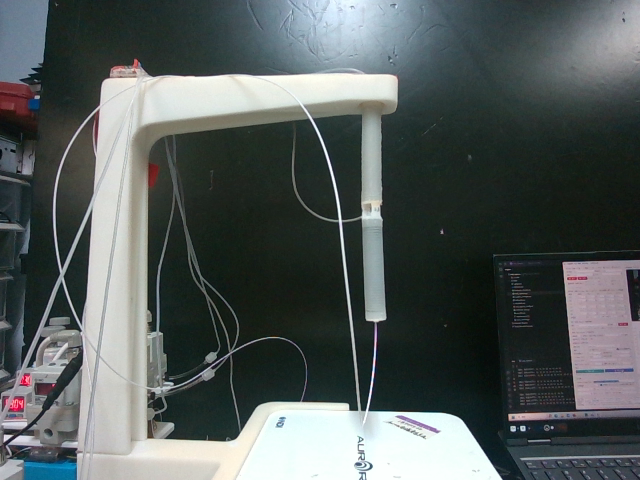
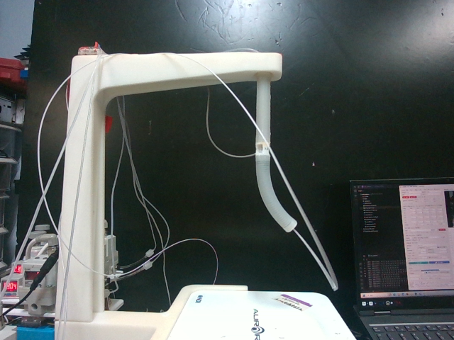
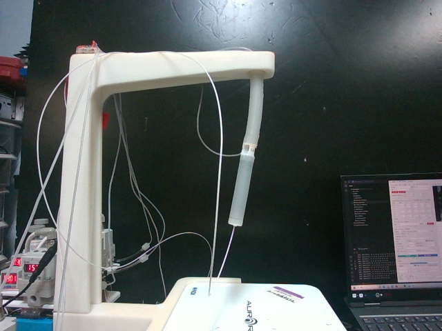
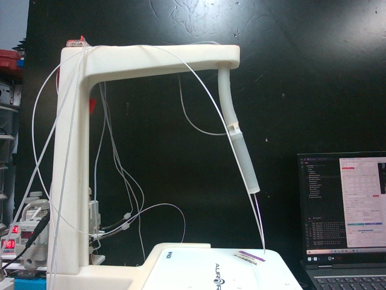

# u0–u3 与阀通道接线实拍对照

以下全部是2026-08-19采集的原始相机图像，按对应 `actions6.csv` 同索引核对，复制时未修改像素。左右均指图中原相机方向；相机镜像、机器人旋转后应以“哪一段、哪一侧弯曲”核对，不能机械照搬屏幕左右。

| 模型输入 | 阀输出/GUI通道 | 图像中的响应 |
|---|---|---|
| u0 | c0；组1 第1路 | 远端/下段向画面左弯 |
| u1 | c1 + c2；组1 第2、3路同步 | 远端/下段向画面右弯 |
| u2 | c3 + c4；组2 第1、2路同步 | 近端/上段向画面左偏；此组幅度较小 |
| u3 | c5；组2 第3路 | 近端/上段向画面右弯 |

默认六腔映射：`[c0,c1,c2,c3,c4,c5] ← [u0,u1,u1,u2,u2,u3]`。这里u编号从0开始；设备面板“第1路”对应代码c0。u1和u2各驱动两腔，现有单输入序列不能区分同组两个物理腔的位置。

先在GUI全局“六腔控制”用自己设定的较低压力逐组试动，确认段别和弯曲方向，再应用六腔映射、完整形状对齐和预热。下图约130–149 kPa只是历史采集时的显示条件，不是接线检查必须施加的压力。

## 零下发压力参考

`seq_20260819_183526 / 00038.png`，六路下发均为0；同压力下形态可能仍受之前动作历史影响。

## u0：c0 · 远端/下段向画面左弯

来源 `seq_20260819_183351/cam0/00185.png`，记录时间 38.656 s。

六路下发压力 kPa：`145.6083, 0.0000, 0.0000, 0.0000, 0.0000, 0.0000`。

## u1：c1 + c2 · 远端/下段向画面右弯

来源 `seq_20260819_183547/cam0/00180.png`，记录时间 37.360 s。

六路下发压力 kPa：`0.0000, 148.9266, 148.9266, 0.0000, 0.0000, 0.0000`。

## u2：c3 + c4 · 近端/上段向画面左偏；此组幅度较小

来源 `seq_20260819_183740/cam0/00730.png`，记录时间 152.797 s。

六路下发压力 kPa：`0.0000, 0.0000, 0.0000, 135.4398, 135.4398, 0.0000`。

## u3：c5 · 近端/上段向画面右弯

来源 `seq_20260819_184036/cam0/00576.png`，记录时间 120.657 s。

六路下发压力 kPa：`0.0000, 0.0000, 0.0000, 0.0000, 0.0000, 132.1562`。

## 接线时容易混淆的地方

- c1/c2 与 c3/c4 是分别同步的两组，现有图片不提供六个独立腔道的逐腔鉴别；两组之间不可混接。
- u0/u1主要改变远端一段，u2/u3主要改变近端一段；近端弯曲也会带动整个远端位移，不能只看tip左右。
- 白色支架、细气管、NDI线缆不是臂身；臂身从顶部悬挂处延伸至末端白色套环，关节位于两段之间。
- 实拍方向只能帮助确认四个动作组，不证明气管已经实际接对；最终以实机逐组响应为准。

[图像与压力来源清单](assets/chamber_mapping_20260910/source_manifest.json) · [电气接口与部署说明](validation_deployment_hardware_and_training_20260910.md)
